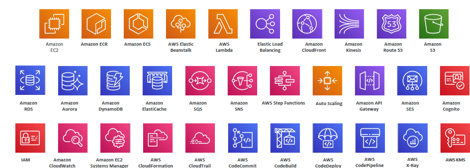

# 1. AWS Services  for DVA
## A. Reference
- https://aws.amazon.com/blogs/
- https://www.udemy.com/course/aws-certified-developer-associate-dva-c01

---
## B. Services



### Compute
- Amazon EC2
- AWS Lambda
- AWS Elastic Beanstalk
- Amazon ECS
- AWS Fargate
- Amazon Auto Scaling

### Containers
- Amazon ECS
- Amazon ECR
- AWS Fargate

### Storage
- Amazon S3
- Amazon Elastic File System (EFS)
- Amazon ElastiCache

### Databases
- Amazon RDS
- Amazon DynamoDB
- Amazon ElastiCache

### Networking & Content Delivery
- Elastic Load Balancing
- Amazon CloudFront
- Amazon Route 53

### Developer Tools
- AWS CodeCommit
- AWS CodeDeploy
- AWS CodeBuild
- AWS CodePipeline

### Monitoring & Observability
- Amazon CloudWatch
- AWS X-Ray

### Security, Identity, and Compliance
- AWS Identity and Access Management (IAM)
- AWS Key Management Service (KMS)

### Management & Governance
- AWS CloudFormation
- AWS CloudTrail
- Amazon EC2 Systems Manager

### Application Integration
- Amazon Simple Queue Service (SQS)
- Amazon Simple Notification Service (SNS)
- Amazon Simple Email Service (SES)
- Amazon API Gateway
- AWS Step Functions

### Analytics
- Amazon Kinesis

### Customer Engagement
- Amazon Cognito

---
# 2. Progress :books:
- https://www.udemy.com/course/aws-certified-developer-associate-dva-c01/learn/lecture/19771482#overview
  - slides: :book: https://courses.datacumulus.com/downloads/certified-developer-k92/
  - practice paper: https://www.udemy.com/course/aws-certified-developer-associate-practice-tests-dva-c01/

## Section 4 `IAM` :green_circle:
- [01_IAM-1.md](../06_Security/01_IAM-1.md) 
- [01_IAM-2.md](../06_Security/01_IAM-2.md)

## Section 5 `EC2` :green_circle:
- [01_EC2.md](../01_compute/01_EC2.md)

## Section 6  `EBS_EFS` :green_circle:
- [01_EBS_EFS.md](../02_storage/01_EBS_EFS.md)

## Section 7 : `ELB_ASG` :green_circle:
- [01_ELB_ASG.md](..%2F04_network%2F01_ELB_ASG.md)


## Section 8 -  `RDS + Aurora + ElastiCache` :green_circle:
```
    ElastiCache Strategies
    Amazon MemoryDB for Redis
```
## Section 9 - `Route 53` :green_circle:
```
    Routing Policy - Traffic Flow & Geoproximity Hands On
```

## Section 10 - `VPC Fundamentals` :green_circle:
- VPC details not needed.
- [04_CloudFront_DVA.md](../04_network/04_CloudFront_DVA.md)
```
    VPC Fundamentals - Section Introduction
    VPC, Subnets, IGW and NAT
    NACL, SG, VPC Flow Logs
    VPC Peering, Endpoints, VPN, DX
    VPC Cheat Sheet & Closing Comments
    Three Tier Architecture
```
## Section 12 - `AWS CLI, SDK, IAM Roles & Policies` :green_circle:
```
    AWS EC2 Instance Metadata
    AWS EC2 Instance Metadata - Hands On
    AWS CLI Profiles
    AWS CLI with MFA
    AWS SDK Overview
    Exponential Backoff & Service Limit Increase
    AWS Credentials Provider & Chain
    AWS Signature v4 Signing
```

## Section 11,13,14 - `S3` :green_circle:
- [03_S3-1.md](../02_storage/03_S3-1.md)
- [03_S3-2.md](../02_storage/03_S3-2.md)
- [03_S3-3.md](../02_storage/03_S3-3.md)

## Section 15 - `CloudFront` :green_circle:
```
    CloudFront - Caching & Caching Policies
    CloudFront - Cache Behaviors
    CloudFront - Caching & Caching Invalidations - Hands On
    CloudFront - Signed URL / Cookies
    CloudFront - Signed URL - Key Groups + Hands On
    CloudFront - Advanced Concepts
    CloudFront - Real Time Logs
```

## Section 16 `ECS, ECR & Fargate` :green_circle:
```
    Amazon ECS - Rolling Updates
    Amazon ECS Task Definitions - Deep Dive
    Amazon ECS Task Definitions - Hands On
    Amazon ECS - Task Placements
    Amazon ECR - Hands On
```
## Section 17 `beanstalk` :yellow_circle:

## Section 18 `Cloudformation` :yellow_circle:

## Section 19 `SQS,SNS, KDS, KDF` :green_circle:
- [05_decoupling](../05_decoupling)

## Section 20 `Monitor` :yellow_circle:
- [01_CW-Metric.md](../07_monitoring/01_CW-Metric.md)
- [02_CW-Logs.md](../07_monitoring/02_CW-Logs.md)
- [03_CW-Alarms.md](../07_monitoring/03_CW-Alarms.md)
- [04_X-rays_DVA.md](../07_monitoring/04_X-rays_DVA.md) :yellow_circle:
- [05_cloudTrail.md](../07_monitoring/05_cloudTrail.md)
- [06_AWS_config.md](../07_monitoring/06_AWS_config.md)

## Section 21 : `lambda` :green_circle:
- [03_lambda-dva-01-CLI.md](../01_compute/03_lambda-dva-01-CLI.md)
- [03_lambda-dva-02-trigger.md](../01_compute/03_lambda-dva-02-trigger.md)
- [03_lambda-dva-03-context+event.md](../01_compute/03_lambda-dva-03-context%2Bevent.md)

## Section 22 : `DynamoDB` :yellow_circle:
- [04_DynamoDB_SSA.md](../03_database/04_DynamoDB_SSA.md)

## Section 23 : `API-gateway` :yellow_circle:

## Section 24 : `CICD` :yellow_circle:

## Section 25 : `SAM :Serverless Application Model` :yellow_circle:

## Section 26 : `CDK` :yellow_circle:

## Section 27 : `Cognito` :yellow_circle:

## Section 28 : `Step function, AppSync` :yellow_circle:

## Section 29: `Advance IAM (short)` :yellow_circle:

## Section 30 : `security: KMS,SSM` :yellow_circle:

## Section 31 : `other services` :red_circle:


