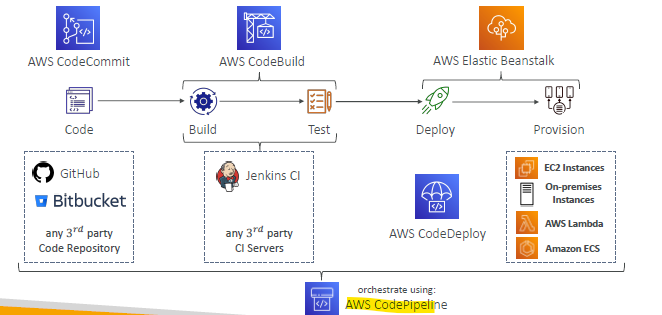
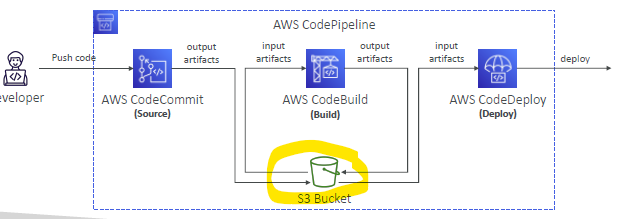
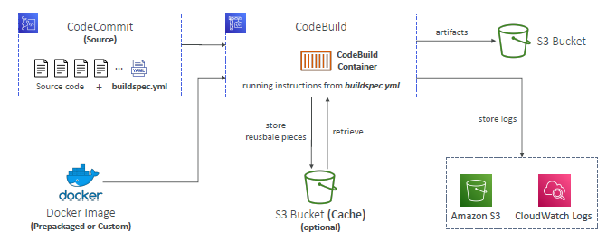
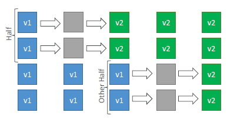
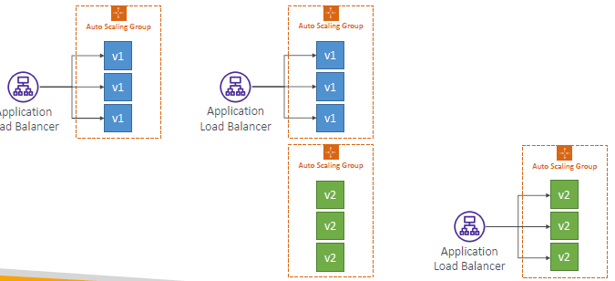
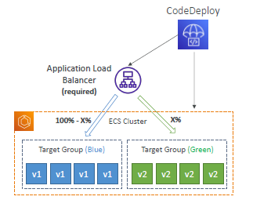

- [05_harness](../../../05_harness)
- [04_terraform](../../../04_terraform)
---
# A. Concept
- CI
- CD
- pipeline
- IAC

# B. CodePipeline
- attach iam role with correct permission.
- **stage/s**
  - stage:success
  - stage:`failed` --> eb:event --> notify
  - **step/s**
    - step:success
    - step:`failed` --> eb:event --> notify
- pipeline creates **artifact** in ` s3`, then passed to next stage.
- 
- 

---
## 0. codeCommit
- VCS
- use external git: **github**
- service terminate in july 2024 for new customer.

---
## 1. CodeBuild
- fully managed continuous integration (CI) service
- **build project**:
  - add `buildspec.yaml` (root dir)
    - env
    - phases
    - artifact for s3
    - cache :point_left:
  - Compile source code, run tests, produce software packages
  - Leverages Docker under the hood for reproducible builds :point_left:
    - build container
    - Use prepackaged Docker images
    


---    
## 2. CodeDeploy
- deploy to ec2, lambda, ECS
- add `appsec.yaml` (root)
- **CodeDeploy Agent** on the target instances
  - on ecs already present
  - ec2/on-prem, install it.
- **deployment speed**:
  - 
```
• AllAtOnce: most downtime
• HalfAtATime: reduced capacity by 50%
• OneAtATime: slowest, lowest availability impact
• Custom: define your %
```
- **Deploy on ASG** :books:
  - **in-place deployment**
    - replace old instance with new version
    - downtime
  - **blue-green deployment** (no downtime)
    - old ASG(blue)
    - create new ASG (green) : and deploy new version.
    - 
    - then use below **traffic routing**  strategies to shift traffic to green ASG :point_left:
      - **Linear**: grow traffic every N minutes until 100%
      - **Canary**: try X percent then 100%
      - **AllAtOnce**: immediate
    - once all shift turn off blue ASG
    - 

- **Rollback**
  - enable automatic rollback option.
  - if deployment fails
  - then make new deployment with last know good revision.
  
### hands on (ECS) :point_left:
- application-1
  - deployment-group-1
    - role-1 (permission to access targets)
    - choose cluster
    - choose ALB and tg
    - choose deployment type : inplace + blue/green
      - traffic routing strategy (allAtOnce, linear, canary)
- appsec.yaml ?
      
### hands on (EC2)
- https://www.udemy.com/course/aws-certified-developer-associate-dva-c01/learn/lecture/11851340#overview

### hands on (lambda)
- soon
---
## 3. AWS CodeStar 
– manage software development activities in one place

---
## 4. AWS CodeArtifact 
– store, publish, and share software packages

---
## 5. AWS CodeGuru 
– automated code **reviews** using Machine Learning