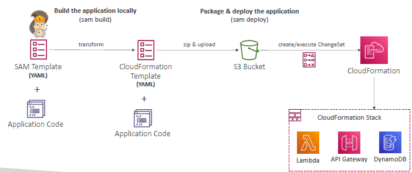
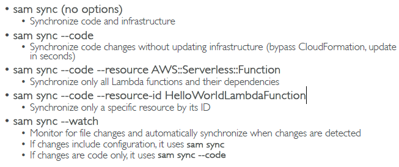
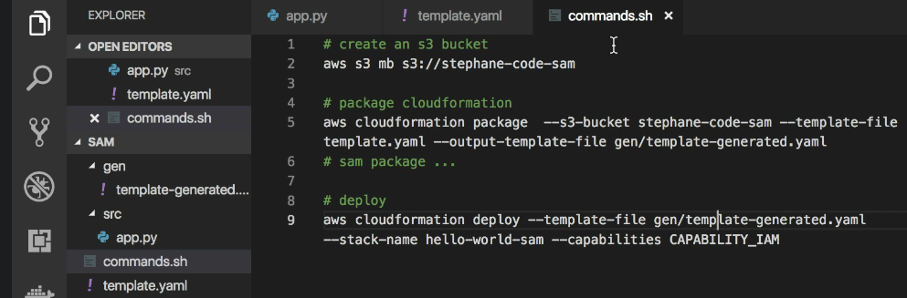
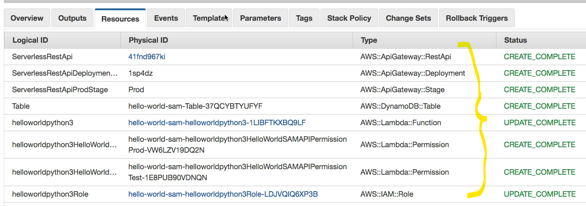
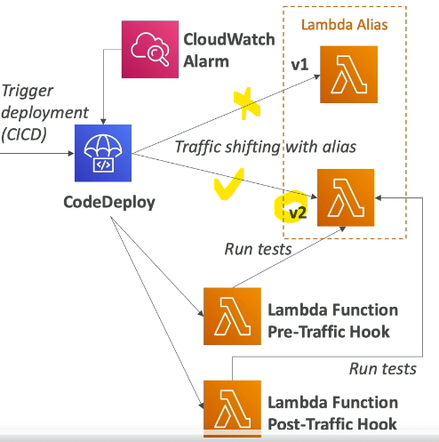
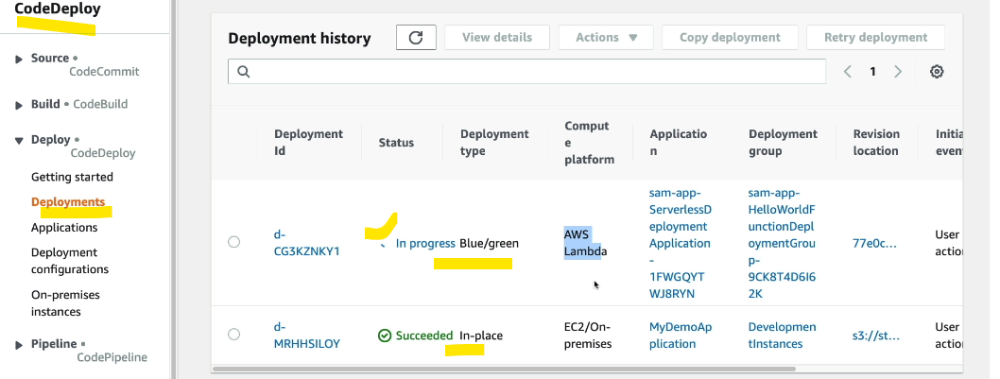
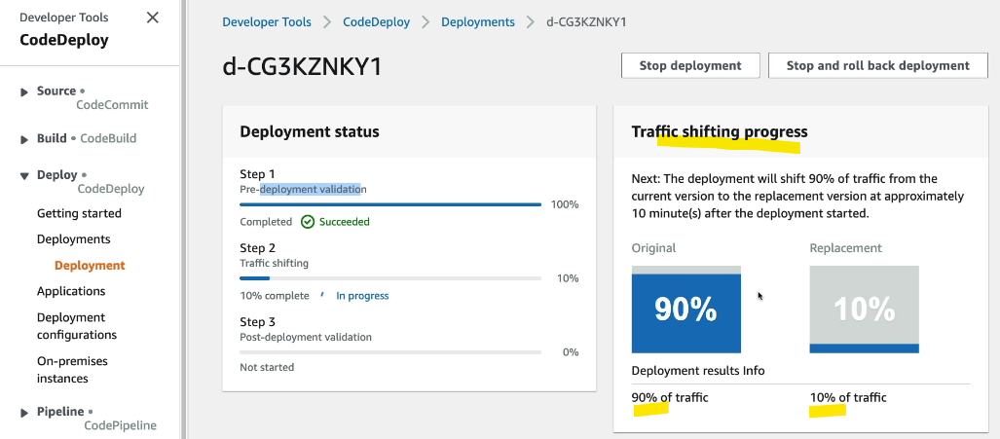
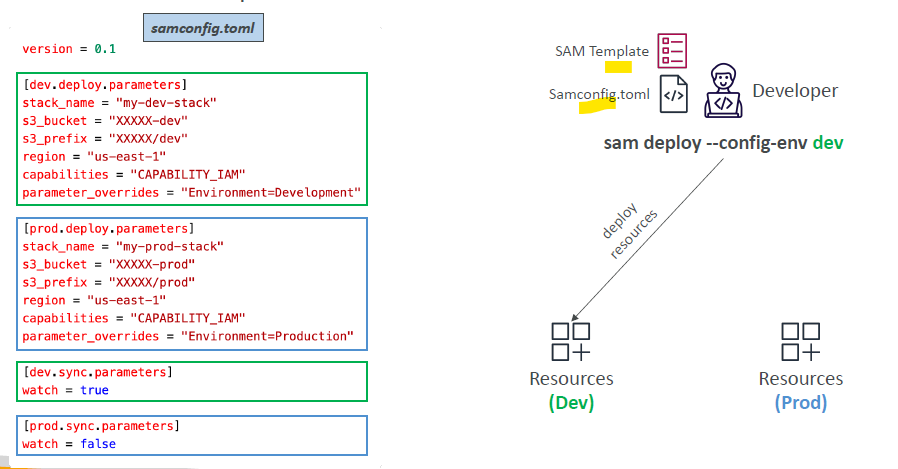

- https://chatgpt.com/c/6763704a-0a24-800d-b9a2-1866b9931f4d
- https://github.com/aws/aws-sam-cli-app-templates
---
# SAM (Serverless Application Model)
- serverless : Lambda, API Gateway, DynamoDB, step function, eventbridge,CW, etc

## A. Intro

- **Framework** for simplifying serverless application deployment
- AWS SAM templates (YAML/JSON).
  - defines **resources**
    - `AWS::Serverless::Function`
    - `AWS::Serverless::Api`
    - `AWS::Serverless::SimpleTable`
    
## B. sam cli
- **sam init**
- **same build**
- **sam package** : creates cloudformation stack
  - `--template-file` 
  - `--output-template-file` 
  - `--s3-bucket`
    - zip and upload (template and code) to s3

- **sam deploy**  : deploy cf stack
  - use **CodeDeploy** to deploy Lambda functions
  
- **sam sync** --watch
  - 

---
## C. Hands ON
### 1. Deploy lambda function-v1 with API-gateway
- added **env var** from template
- added **polices** from template

```yaml
AWSTemplateFormatVersion: '2010-09-09'
Transform: AWS::Serverless-2016-10-31
Description: A simple AWS SAM example

Resources:
  HelloWorldFunction:
    Type: AWS::Serverless::Function
    Properties:
      Handler: app.lambda_handler
      Runtime: python3.11
      CodeUri: lambda/
      
      # Environmnet var
      Environment:
        Variables:
          # TABLE_NAME: HelloWorldTable
          TABLE_NAME: !Ref HelloWorldTable
          REGION_NAME: !Ref AWS::Region
      
      # polices to perform CRUD on table    
      Policies:
        - DynamoDBCrudPolicy:
            TableName: !Ref HelloWorldTable
      
      # expose as API gateway      
      Events:
        HelloWorldApi:
          Type: AWS::Serverless::Api
          Properties:
            Path: /hello
            Method: get
            StageName: prod
            Cors:
              AllowMethods: "'GET,POST'"
              AllowHeaders: "'Content-Type'"
              AllowOrigin: "'*'"
```
---

### 2. add DynamoDB table
```yaml

Resources:  
  HelloWorldTable:
    Type: AWS::DynamoDB::Table
    Properties:
      TableName: HelloWorldTable
      PrimaryKey:
        Name: id
        Type: String
      ProvisionedThroughput:
        ReadCapacityUnits: 5
        WriteCapacityUnits: 5
```

---

### 3. Deploy lambda function-v2 using codeDeploy(blue/green)
- Steps:
  - update template:
    - add **DeploymentPreference** - `Canary10Percent10Minutes`
    - sam will use codeDeploy :point_left:
  - update lambda code, then deploy again with sam
    - **sam build**
    - **sam deploy -guided**
  
- **codeDeploy** : [00_start.md](../24_CI_CD/00_start.md)
  - deployment type
    - **in-place**
    - **blue/green** :point_left:
      - **traffic routing**:
        - `canary`
        - `linear`
        - `allAtOnce`
      - **traffic hook** (optional)
        - pre-traffic hook - lambda-hook-fn-1 
        - post-traffic hook - lambda-hook-fn-2
- Also, configure **cloudwatch alarm** for deploymnet failure



```yaml
  # update lamda
  AutoPublishAlias: live  
  DeploymentPreference:
      Type: Canary10Percent10Minutes
      Alarms:
        - !Ref DeploymentFailureAlarm

  # Another resource
  DeploymentFailureAlarm:
    Type: AWS::CloudWatch::Alarm
    Properties:
      AlarmName: DeploymentFailureAlarm
      MetricName: Errors
      Namespace: AWS/Lambda
      Statistic: Sum
      Period: 60
      EvaluationPeriods: 1
      Threshold: 1
      ComparisonOperator: GreaterThanOrEqualToThreshold
      Dimensions:
        - Name: FunctionName
          Value: !Ref HelloWorldFunction
        - Name: Resource
          Value: !Join ["", [!Ref HelloWorldFunction, ":", "live"]] 
```





---
## D. sam **`local`** 
- Provides a lambda-like execution environment locally
- Locally build, test, and debug your serverless applications that are defined using AWS SAM templates

- **sam local start-lambda** + **sam local invoke**
- **sam local start-api**
- **sam local generate-event**

---
## D. sam **`environment`** 

