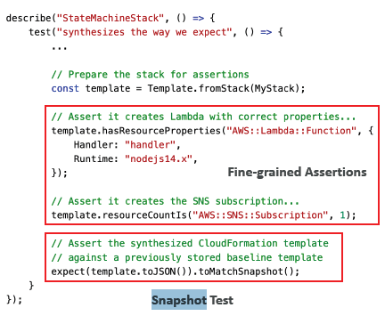

# CDK
- Cloud developmnet kit
## A. intro
- IaC with program language - py,java, nodejs
- compile and then generate cloudFormation template yaml.
- SAM focus on serverless. CDK is superset of SAM
- **CDK construct**
  - level of abstraction:
    - level-1
      - import { `CfnBucket` } from 'aws-cdk-lib/aws-s3';
    - level-2 (simplified API)
      - import { `Bucket`, BucketEncryption } from 'aws-cdk-lib/aws-s3';
    - level-3 (**pattern**) 
      - import { `LambdaRestApi` } from 'aws-cdk-lib/aws-apigateway';
  
---
## B. CDK cli
- **cdk bootstrap** aws://<aws_account>/<aws_region> :point_left:
    - creates a stack, name :**CDKtoolkit**, contains
        - `S3 Bucket` – to store files
        - `IAM Roles` – to grant permissions to perform deployments
      
- **cdk init**
  - create cdk project
  - lib folder has stack
- **cdk synth**
- **cdk deploy** stack-1
- **cdk diff**
- **cdk destroy**

---
## C. CDK hands on (nodejs)

---
## D. CDK test
- test frameworks
  - Jest (JavaScript) 
  - Pytest (Python)
- import a template :point_left:
  - **Template.fromStack**(MyStack) : stack built in CDK
  - **Template.fromString**(mystring) : stack build outside CDK
- Type of test:
  - **Fine-grained Assertions**
  - **Snapshot Test**
  - 

