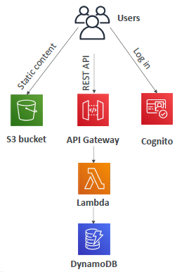

# Serverless services in AWS
- there is underlying server/ec2-i,
- but don't need to provision/manage it
- modern paradigm

## A. services
### compute
  - AWS Lambda : [03_serverless_lambda.md](../01_compute/03_lambda-saa)
  - Fargate(ECS/EKS) 
    - [02_Containers_ECS.md](../01_compute/02_Containers_ECS.md)
    - [02_Kubernetes_EKS.md](../01_compute/02_Kubernetes_EKS.md)
  - Step Functions

### security
  - AWS Cognito [02_cognito.md](../06_Security/02_cognito.md)

### Database
  - Aurora Serverless : [02_Aurora.md](../03_database/02_Aurora.md)
  - DynamoDB : [04_DynamoDB.md](../03_database/04_DynamoDB.md)

### integration/core
- AWS API Gateway [05_API_gateway.md](../04_network/05_API_gateway.md)
- Amazon S3
  - [03_S3-1.md](../02_storage/03_S3-1.md)
  - [03_S3-2.md](../02_storage/03_S3-2.md)
  - [03_S3-3.md](../02_storage/03_S3-3.md)
- AWS SNS  [02_SNS.md](../05_decoupling/02_SNS.md)
- SQS [01_SQS.md](../05_decoupling/01_SQS.md)
- AWS KDF [03_02_KDF_KinesisDataFirehose.md](../05_decoupling/03_02_KDF_KinesisDataFirehose.md)

## B. Architecture example
- 
