## A. docker
- [02_docker](..%2F..%2F02_docker)
- **machine** vs **virtual machine** vs **container** (partial virtualization : share OS, n/w)
- image --> run on docker-agent --> **Container** 
  - docker-demon / container-d
  - ecs-agent on ec2-i
- container mgt tool in AWS : 
  - container orchestration : ecs and eks(k8s)
  - image repo : ecr, 
  - launch type : fargate or ec2
- 

--- 
## B. k8s vs ECS
- Analogy with k8s.
  - `eks cluster` - **ecs cluster**
  - `worker-node` -  fargate or **ec2 nodes**.
  - `pod`(c1) - **task**(c1) or **service**[task]
  - `pod/rs/deployment` manifest yaml - **task definition**
  -` control panel/master node`  - ?
  - `service` - **ALB** --> tg --> asg [task-1]
    - desired task = 1
    - max task count = 3
  - `task schedular` - ?

---
## C. ECS  (elastic container service)
- For fargate launch, don't think underlying ec2-i/s
- ECS-cluster (with launch type = ec2)
  - EC2-i1 (`docker-agent`) 
    - task-1 (c1)
    - task-2 (c2)
    - ...
  - EC2-i2 : task-11, task-22, ...
  - EC2-i3 : task-111, task-222, ...
  - ...
  
### ECS Demo:(launchtype = ec2)
#### 1 create **cluster-1** 
  - launchType : ec2 (worker nodes)
  - has **ECS-Cluster capacity provider** :point_left:

#### 2 create **task-definition-1** : `json` metadata
  - **resources** 
    - os
    - cpu, ram
  - **task-role(1)** : attach to ecs-agent  (permission - ecr, cw, ecs)
  - **task-exec-role(each definition)** : attach to task.
  - **container/s**  : `max 10` :point_left:
    - `image uri `
    - `port mapping`
      - container-port
      - host-port: 
        - for ec2 launch:: if 0, then get dynamic port and alb finds it.  :point_left:
        - for fargate launch :: not needed.
    - `env var`
      - hardcode
      - read from SSM store / secret manager
      - bulk fetch env file from s3 :o:
      - 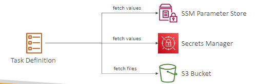
    - `storage` : EFS or default(21GB EBS)
      - ec2-i storage : **bind mount** to c1,c2,etc
      - for fargate use ephemeral storage. ? 
      - 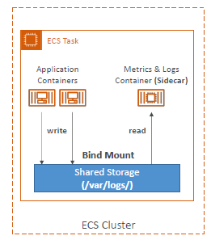

#### 3 **run task**:
  - task (for job) **directly**,  
  - or wrap task with **service** (for long-running web-app) : srv1:[t1,t2,t3]
    - service name - `service-1`
    - choose :  task-definition :`task-definition-1` **
    - Desire capacity : 2 tasks - task-1(c1), task-2(c2)
    - Define **networking**
      - choose `subnet/VPC`
      - create `sg` : allow traffic http,etc --> this will attach to ec2-i or `hidden-ec2-i/in-fargate`

#### 4 **expose** task/service 
- create **ALB-1**
  - health check for tg
  - listener(http:80)  --> tg-1 --> [  task-1(c1), task-2(c2) ]
- host-port : if 0, then get dynamic port and alb will find those  :point_left:
- 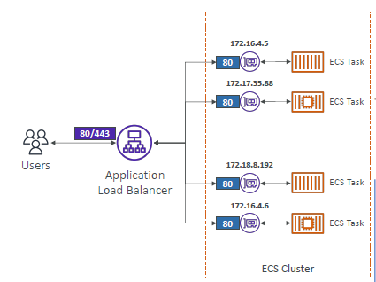
- 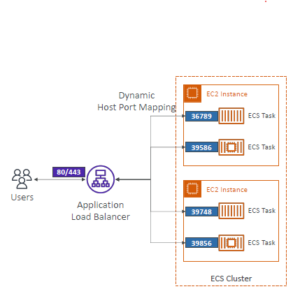
  
#### 5 Auto Scaling 
- create **ASG-1** to scale up/down task 
- For ec2 launch
  - option-1 (`ASG-1`) : CW --> metric(CPU,etc) --> `ASG`(task)
  - option-2 (`ECS-Cluster capcity provider`): preferred to use, smart, better.
- For fargate: easy
  - ECS-Cluster capacity provider : intelligent to do everything.

#### 6 task placement (ec2 launch type)
- note: ec2 instance role : add permission to pull image from ecr
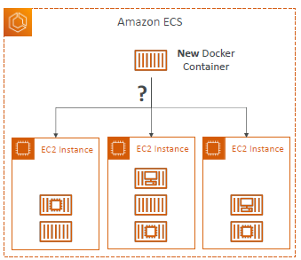
- statisfy:
  - **1 CPU, memory, and port requirements**
  - **2 Task Placement Strategy**
    - `Binpack` : fill ec2-i1 first, then ec2-i2, etc
    - `random` 
    - `spread` : 
      - Tasks are placed evenly based on the specified value
      - eg: instanceId, az, etc
  - **3 Task Placement Constraints**
    - `distinctInstance` : different EC2 instances
    - `memberOf` :  member Of **expression** (`CQL` - cluster query language - advance)
      ```
      "placemnetConstraints :[
            {
                "type": "memberof"
                "expression" : "attribute:ecs.instance-type =~ t2.*"
            }
      ]
      ```

####  READY :green_circle:
- check cluster > task > container, logs/event,
- update service - manually update Desire capacity : 5
- in prod, service Auto Scaling (ASG, ECS-Cluster capcity provider) will do same.

#### 7 update task
- `rolling update` 
  - **default**:
    - min healthy: 100%
    - max : 200%
- more example for understaning:
  - **min : 50% and max: 100%**
    - 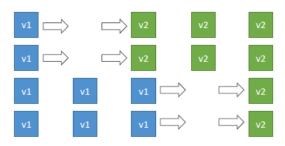
  - **min : 100% and max: 150%**
    - 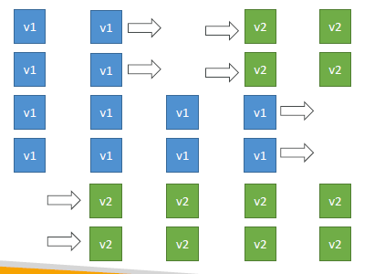

---      
## D. screenshot
### 1. launch type:
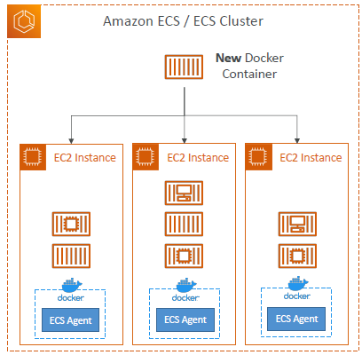 

### 2. iam roles/policies:
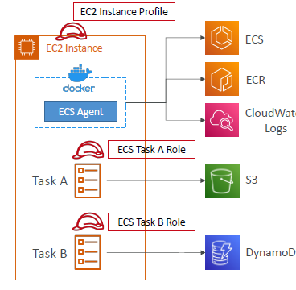
### 3. alb

### 4. Storage:

### 5 scale : ASG + Ecs-cluster capcity provider
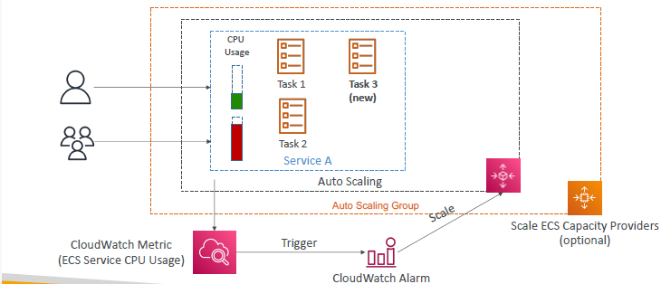

--- 
## E. trigger ecs task
### 1 with eventBridge ( trigger )

### 2 with eventBridge ( scheduled )
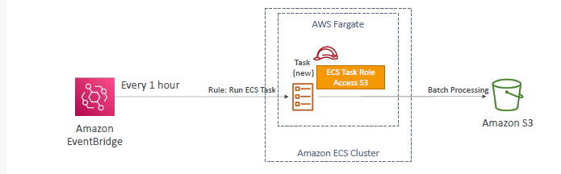
### 3 with SQS + autoScale


---
## F.alerts


