- https://docs.aws.amazon.com/lambda/latest/dg/welcome.html
--- 
# AWS Lambda 
## A. Lambda:Function
- 
- lambda initially was `FaaS`. Now serverless : `provision code/function` 
- lambda@edge - globally service. :point_left:
  - author: **us-east-1**
  - replicated to edge location from author.
- invoke:
  - by services(eg: s3 trigger lambda)
  - by SDK/CLI
    - `--invocation-type Event` for making async call from cli
- Avoid using recursive code, never have a Lambda function call itself :point_left: :point_left:

### 1. Scaling
- auto-scale with load` (parallel Lambdas, `max- 1000`)
- 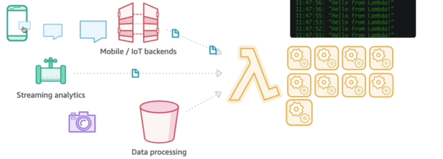

### 2. Network :o:
- default: run in **aws owned VPC** (has public internet access) 
- run inside our **VPC-1** and subnet
  - attach **ENI** to lambda
    - ENI has SG
      - define ingress/egress.
  - deployed in `private subnet` --> don't have internet access
  - deployed in `public subnet` (igw attached)
    - still **don't have internet** access by-default :point_left: :point_left:
  - Get internet access with **NAT**
    - 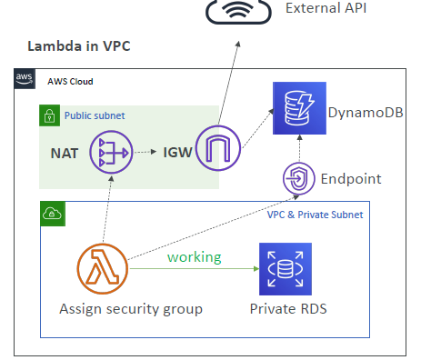
    - deploy lambda in private subnet
    - update rtb, to route traffic 0.0.0.0.\0 traffic to NAT gateway
    - this is the only way.
  
### 3. Pricing
- cost-efficient
- **no of call**: First 1M free, then `20cent/million req`
- **cpu usage**: First 400K GB-second free, then `$1/600K GB-second`

### 4. Security
- Attach IAM role with fine grain access to lambda. eg:
  - cw:log-group
  - sqs:poll (event source mapping)
  - ...
- **lambda resource based policy** 
  - who can invoke the Lambda function and under what conditions 
  - eg: allow S3 bucket:

---
### 5. programming things :books:
- **create function**:
  - [create function with x-ray tracing](https://www.udemy.com/course/aws-certified-developer-associate-dva-c01/learn/lecture/26623428#overview)
  - create from web-console, cli commands, terraform plan, cloudFormation template (upload zip to s3 (versioned))
  - 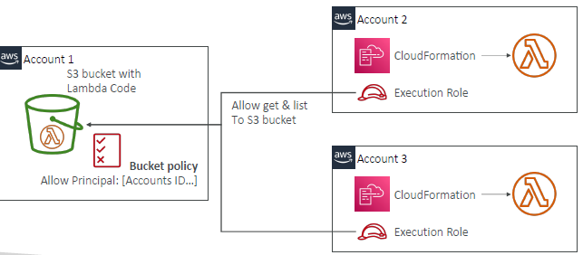

#### **5.0. Basic**
- **compute-time /timeout**: 
  - `0 - 15 min` 
  - or, `0 - 900 sec`
  - default : `3 seconds`

- **handler** : file.method (eg: l_function.l_handler(`event`,`context`))
  - **context** - metadata about the Lambda function execution environment.
    - re-use for multiple invocation.
    - great for DB connection, Http client, etc
    - **cold start**: first call will have latency to init context.
  - **event** - contains the input data for the Lambda function.
  - sample: [03_lambda-dva-03-context+event.md](03_lambda-dva-03-context%2Bevent.md)
  
- **language/runtime** : 
  - node, py, java, Golang, C#/Ruby, `Custom Runtime - rust/golang`
  - java 11 or above : performance is 10x (free) - `SnapStart feature` :point_left:
  - 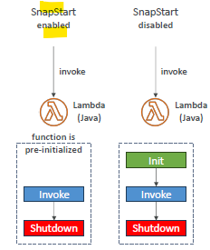
  
- **build pkg size** :
  - `50 MB`  compressed
  - `250 MB` code+dependency

#### **5.1 resource**
  - **RAM** : `128 MB -10 GB`
    - implicitly improves network as well
    - implicitly add more CPU credit.
  - **disk**
    - `/tmp`- **ephemeral storage** : 
      - space for writing temp files. 
      - no shared.
    - `512 MD to 10 GB`
    - if needed permanent space, use:
      - `s3`,
      - `EFS` : very fast (if running inside our vpc-1) :point_left:
      - can be shared among lambda/s
    - programmatically encrypt /tmp using KMS keys. generate ir first. 
    - 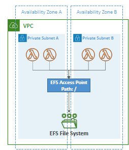
---  
#### **5.2. ENV var** 
- `4 KB`
- can encrypt them as well :point_left:
- sample py code:
  ```
  import os;
  os.getenv("ENV_VAR_1")
  ```
---  
#### **5.3. Monitor** :o:
- **inbuilt metric**
  - `iterator-age`: can check **stream** iterator/offset/sequence :point_left:
  - `concurrent-execution`
  - `Throttle`
  - `Async delivery failure`
  - ...
- **log-group** : /aws/lambda/lambda-1/
- **traces** :point_left:
  - Enable **Active Tracing**, to run the **X-Ray daemon**
  - add this to Lambda-role : `AWSXRayDaemonWriteAccess`
  - Environment variables to communicate with X-Ray
    - `_X_AMZN_TRACE_ID`: contains the tracing header
    - `AWS_XRAY_CONTEXT_MISSING`: by default, LOG_ERROR
    - `AWS_XRAY_DAEMON_ADDRESS`: the X-Ray Daemon IP_ADDRESS:PORT
  - Use AWS X-Ray SDK in Code
    - use these env var and write trace.

---
#### **5.4.lambda layer** 
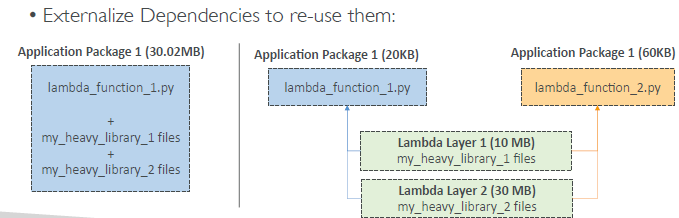
- 5 layer max
- 250 MB total
- aws-sdk dependency : no need to pkg in zip. :)

---
#### **5.5. Lambda Container Image**
- run docker image in lambda Function
- `base image` : lambda runtime API
- eg: FROM amazon/aws-lambda-nodejs:12
- to run javacode, provides JVM runtime. 
  - similar provide `container-d` runtime.
- 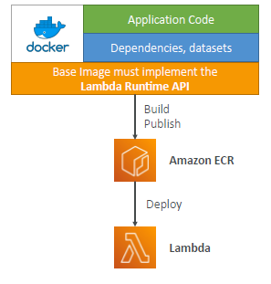
---
#### **5.6. Concurrency**
- set **reservedConcurrency**
  - `max/default = 1000` (can be increased on request)
  - **combined** for all function/s together. :point_left:
    - function-1 has 500 invocation
    - function-2 has 500 invocation
    - function-3 will get **retry** first and then give **ThrottleError (429)**

- 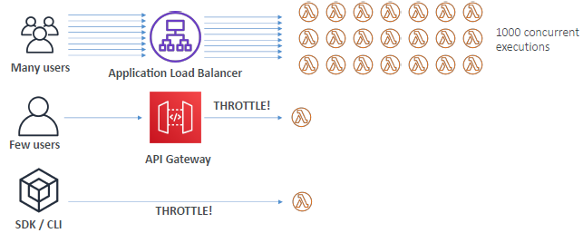
- **retry**:
  - for `sync` invocation - 2 times
  - for `a-sync` invocation: 
    - retry attempt exponentially increases from `1 second - 5 minutes`
    - `max 6 hrs`
    
- **provisioned concurrency**
  - configure it to have **warm start**, else cold-start.

---
#### **5.7 CodeGuru**  (java/py)
- **developer tool** powered by machine learning (ML)
  - Identifies performance bottlenecks
  - Offers recommendations to optimize CPU and memory usage, helping to reduce costs
  - Enforces coding standards and recommends fixes for anti-patterns
  - Detects common security vulnerabilities

- When activated, Lambda adds:
  - **CodeGuruProfiler layer** to function
  - Env vars to your function
  - `AmazonCodeGuruProfilerAgentAccess` policy to your function
---
## B. integration with other services :green_circle: 
- **lambda trigger** patterns:  :point_left:
  - **Event source mapping** 
  - **Synchronous** 
  - **A-synchronous**
  - details: [03_lambda-dva-02-trigger.md](03_lambda-dva-02-trigger.md) for details

- all common eg:
  - **API-gateway** (REST) >> lambda
  - **ALB** >> target-group-1:lambda :o:
    - 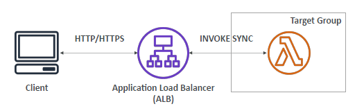
  - **S3:objectcreate,etc** >> lambda :o:
  - **CW:log-event||loggroup-subscription-filter** >> lambda (log-processing)
  - **DynamoDB-streams** >> lambda
  - **SQS/SNS:consumer** > Consumer/Subscriber > lambda/s :o:
  - **KDS:consumer** >> Lambda/s
  - web-client-req --> **CloudFront** ( **lambda@Edge** :customize req+some processing ) --> origin
  - **IAM:cognito** >> Lambda
  - **other services's event** >> eventBridge(**`EventRule`**/**`cron scheduler`**)  >> Lambda :point_left:
    - codePipeline's in-built event, say e1 > eventBridge(bus) > EventRule-1 (capture e1) > lambda-1 (process)
    - ...
    - generic pattern :)
- 

---
## C. Architecture example
- 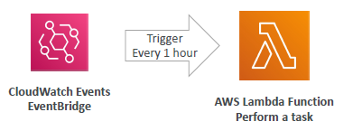
- 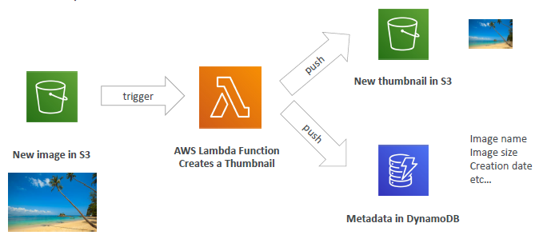
- 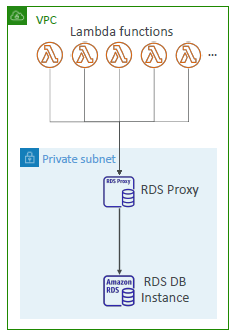

## D. extra
### 1. limit summary
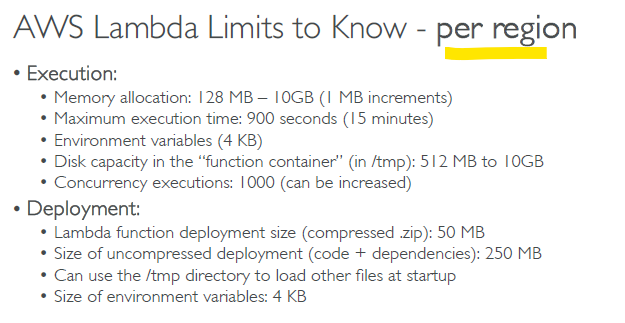
  
