# Lambda Invocations
## A. `Synchronous`
- below services make sync/blocking call:
  - ALB, Amazon API Gateway, CloudFront (Lambda@Edge)
  - Amazon S3-Batch
  - Amazon Cognito
  - AWS Step Functions
  - Amazon Lex
  - Amazon Alexa
  - Amazon Kinesis Data Firehose
  
---  
###  A.1 **ALB**
- 
- **Flow**
  - http/s request  comes to ELB
  - elb `converts` **http request into json** object and pass to **event** arg
  - call lambda-1 > handler-1(**event**, context)
  - lambda sends json object as response
  - ELB `converts` **lambda-response into http-response**
  ```
  {
  "statusCode": 200,
  "statusDescription": "200 OK",
  "isBase64Encoded": false,
  "headers": {
    "Content-Type": "text/html",
    "Set-Cookie": "cookie1=value1; Path=/; HttpOnly",
      "Custom-Header": "value"
    },
  "body": "<html><body>Hello from Lambda!</body></html>"
  }
  ```
- **conversions**:
  - 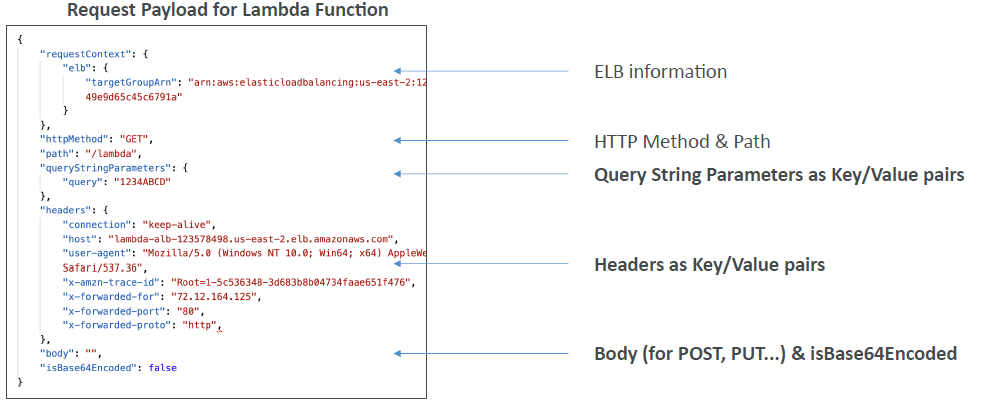
  - 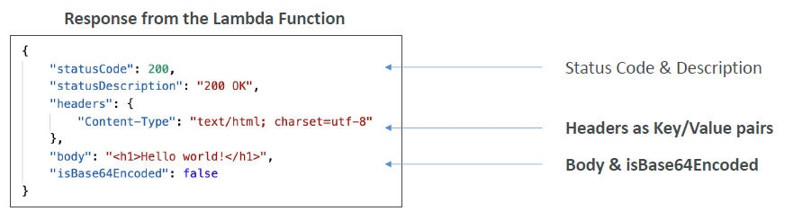
- **ALB Multi-Header Values** : enable/disable this feature. :point_left:
  - notice queryparams,headers `array`
  - 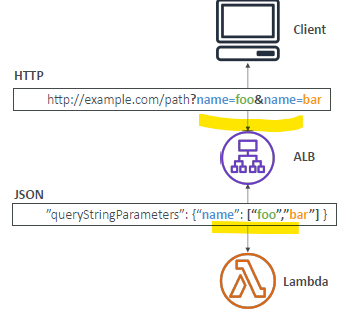

---
###  A.2 **gateway**
- soon

---
---
## B `A-synchronous`
- below services(event-based) make a-sync/non-blocking call:
  - s3:evnetNotification
  - SQS, SNS, SES(email)
  - CW:log-events||subscription-filter
  - more (not in scope of exam)
    - AWS codeCommit + codePiprline + cloudformation
    - AWS config
    - AWs IoT
- **internal eventQueue** :o:
  - event --> eventSQSQueue [e1,e2,...] --> LambdaService reads event and invoke lambda functions async.
  - if throttleError, LambdaService will return event back to internal eventQueue.
---
### :green_circle: B.1 S3:event notification 
- 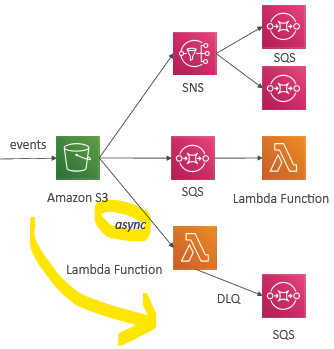
- 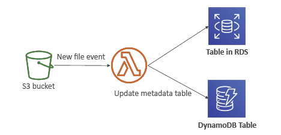
- create s3 bucket > properties tab >> create s3 notification
  - set **prefix** +  s3:objectCreate event
  - set **target** : lambda-1 (lambda-policy-1: allow s3)
- create DLQ or destination(OnFailure)

---
### :green_circle: B.2 SQS 
- 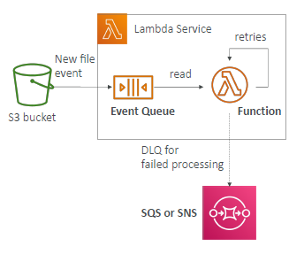
- message dropped on SQS queue-1
- sqs-event will call lambda async does (non-blocking)
- next, lambda-1 >> configuration tab >> **asynchronous invocation** section. :point_left:
  - add `DLQ-1` on lambda(not on queue-1)
  - set `retry attempt` = 0,1,2
  - also, update lambda-role-1: + sqsSend permission
- if exception thrown from lambda(consumer), then lambda will retry
  - keep lambda code **Idempotent** 
  - after **reties** goes to DLQ-1

---
### :green_circle: B.3 Event-bridge (generic pattern)
- **trigger**:
  - EventRule
  - schedular
  - 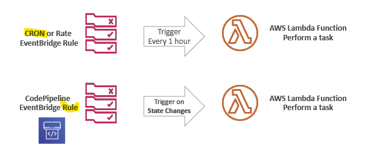

---
## C. `Event Source Mapping` (Poller) + batch
- [udemy reference](https://www.udemy.com/course/aws-certified-developer-associate-dva-c01/learn/lecture/19730528#overview)
-  Lambda is triggered **`synchronously` with `batch`** :point_left:
- by **polling data** from below **3 poll-based services** :point_left:
  -  Queue based: **Queue Poller** : `SQS` : ordered, if FIFO.
  -  streams based: **Stream Poller** : `KDS` : ordered  + `DynamoDB Streams`

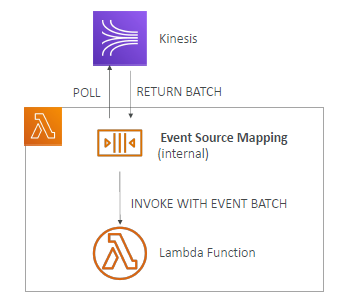
- lambda will scale out, based on active message.

---
### :yellow_circle: C.1 SQS : Queue
- 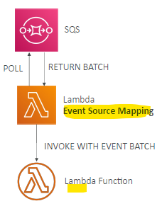
- Event Source Mapping will poll SQS (Long Polling)
- **configuration**:
  - **batch size**  + **batch Window**
  - recommended : Set the queue **visibility timeout** = 6x Lambda-1::timeout
  - set-up **DLQ-1** on the SQS queue.
  - preferred way : destination (on-failure)
- **more**:
  - For **FIFO queue** : lambda supports in order processing.
  - lambda will **delete** item, after processing. :point_left:
  

---
### :yellow_circle: C.2 KDS : stream
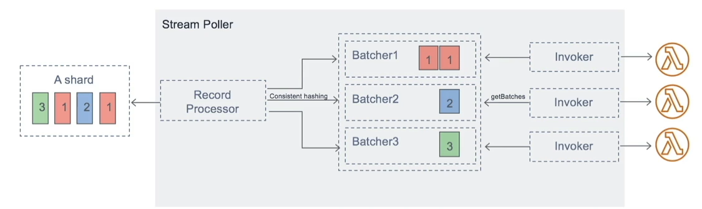
- **parallelization**: can have upto `10 batches` per shard.
- **in-order processing** : processing for the **affected shard** is paused, until the error is resolved
```
- shard-1
  - poll-1 > batch-1 > lambda-1-instance-1
  - poll-2 > batch-2 > **lambda-1-instance-2**   <<< errored out
  - ...
  - ...
  - poll-10 > batch-10 > lambda-1-instance-10
  
  if lambda-1-instance-2 excution error out, entire shard-1 will be on hold/paused   <<<
  
  And entire batch, batch-2 will be reprocessed.                                     <<<
```
- **Configuration**:
  - discard batch
    - will go to **Destination**
  - restrict the number of retries

---
### :yellow_circle: C.3 DynamoDB : stream 
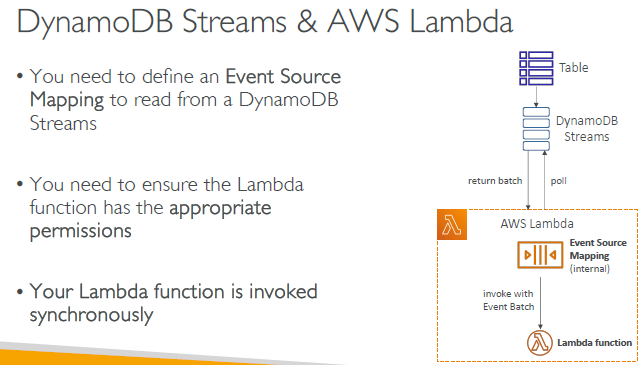- soon

---

## D :o: Destination (2019)
- [udemy reference](https://www.udemy.com/course/aws-certified-developer-associate-dva-c01/learn/lecture/19730538#overview)
- new, preferred, 4  services
  - sqs
  - sns
  - another-lambda,
  - event-bus
- in ccgg
  - lambda > java-rest-api > programmatically writing into success fifo queue.
  - so achieving same behaviour.
  
### D.1 Async invocation: `failure`
- **Destination**  (condition: OnFailure)
- **DLQ**  (old, only 2 service, we did before)
  - sqs
  - sns

### D.2 Async invocation: `success`
- **destination** (condition: OnSuccess)

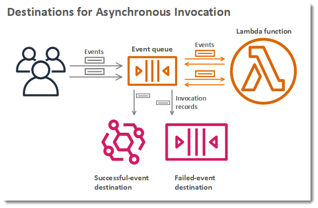

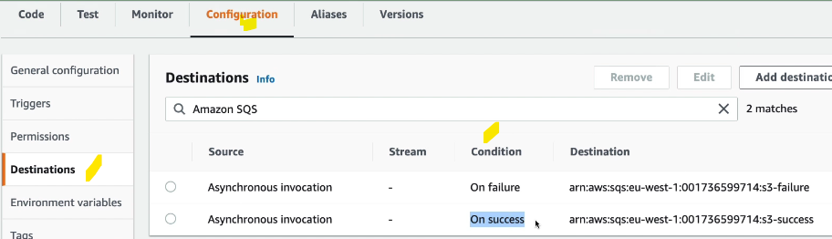

### D.3 Event Source mapping: `discard batch`


