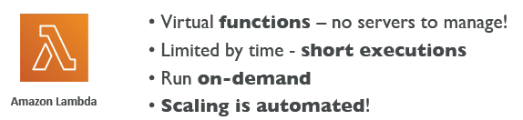
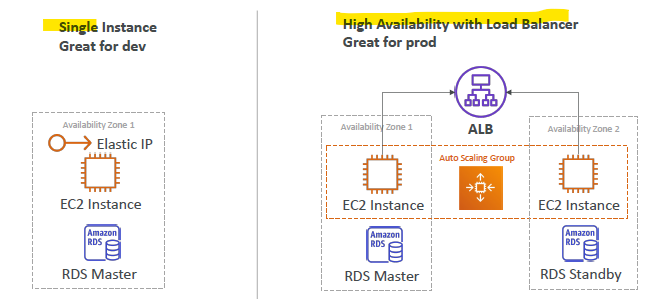

# Elastic Beanstalk 
## A. Common **Web** Architecture

## B. Intro
- Managed services, deals with:
  - **Managing infrastructure**
    - databases
    - load balancers
    - ASG
  - **Deploying Code**
  
## C. pricing
- free 
- but pay for underlying infra.

## D. Components:
- **Application** 
  - **configuration**
  - **Application version** 
  - **Environment/s** :  `dev, prod, qa`
    - AWS resource running application.
    - Tier
      - web server env
      - worker env
      -   
      
---    
## E. Deployment Modes

---
## hands on
- Create Application
  - create environmnet
    - choose tier : web* or worker
  - choose platform : language,runtime,etc - java,etc
  - code : upload
  - Configuration preset
    - deployment mode - single, high ava
    - custom
      - ...
      - ...
      - ...
  - role
    - add pre created policies : 
      - `AWSElasticBeanStalkWebTier`,
      - `AWSElasticBeanStalkWorkerTier`, 
      - `AWSElasticBeanStalkMultiContainerDocker`
      - ...
      - ...
      
- it creates `cloudFormation template`
  - view the template in appl-composer.

- get domain url and use it.
- upload new code, seamlessly.
- check other tab : CW, monitor, mmanged updates, alarms, health, etc
- Check `configuration` link on left
  - show all the configs for env
  - edit them