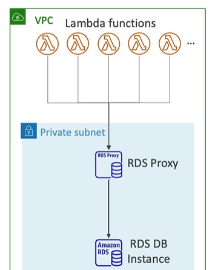

- **AWS RDBMS offering** 
  - Option-1 : `on EC2`
    - Provision Ec2
    - install RDBMS and maintain it (os patching, security update, etc)
  - Option-2 : AWS `Aurora`
  - **Option-3** : AWS `RDS` 

---
# RDS (regional)
- regional, run on single-AZ or mutli-az.
- manually manage : multi-AZ:t/f ; CW>Alarm>R-replicaScale, etc
- Automated provisioning, OS patching, just choose maintenance window.

## 1 provision:
- choose **EBS volume type**: 
  - `gp2`  
  - `io1`
- choose **RDS ec2 instance s** : compute family size
  - no access/ssh
  - But `RDS custom` allow to access it  only for `SQL server` and `oracle` DB.
  - First disable automation mode, take snapshot, then access it
  - R51DS custom, allow some customization capabilities of underlying DB and OS (limited)
- choose **Supported engine**: 6 + 1
  - Postgres, MySQL, MariaDB, Oracle, Microsoft SQL Server, IBM DB2
  - `Aurora` (AWS Proprietary database, not open source)
  
##  2 Advantages of RDS
### 2.1 Scaling
- For performance >> `Read-replica Auto-scale` : 
  - Max 15, min 1.
  -`not built-in` scaling, but can manually create CW:alarm + ASG
  - ASG and CW alarm ( metric: conn count, cpu utilization, read traffic, etc)
  - or, manually edit and create read replication.
- For Size >> `storage Auto-scale`: Enable/Disable from console.
  - good for unpredictable workloads
  - set max storage in GB/TB.
  - define `thresold`/maz-size  +  `trigger` : free space <10%, space runs last 5min, etc.

### 2.2 DR
-  `Point in Time Restore` : Continuous backups and restore to specific timestamp
- **option-1**:  Stand-by replica  
  - `manually enable` Multi AZ-setup for DR, not built-in.
  - master DB (az-1) --> `SYNC replica/free` --> Stand-by DB (az-2) : no R/W operation
  - `Automatic fail-over` from master to standby.
  - just single click, can go from Single-AZ to multi-AZ RDS
    - bts : Single-AZ RDS --> screenShot (already taken) --> will be restored to Standby DB
    
- **option-2** : Promote Read replica.
  - RDS(single-region) --> 1hr --> backup/snapshot --> goes to S3 
    - bkp: not directly accessible, managed by aws
    - manually restore the backup into another region, in DR situation.
  - `cross-region`-read replicas, is also possible : paid
  - DR fail-over : `promote` any READ replica as main DB later.
  
### 2.3 performance
- `Main DB` + `Read replica/s` for improved read performance.
- Up to 15 READ replica/s 
  - within a AZ, or
  - cross-AZ, or
  - cross-region
- main-DB --> `A-SYNC replication (free within region)` --> Read Replicas
- `cross-region`-read replicas, is also possible : paid
- tip: can run `Dashboard`, `Analytics` on read replicas.

### 2.4 Security
- `At-rest` encryption:
  - Database master & replicas encryption using AWS KMS
  - If the master is not encrypted, the read replicas cannot be encrypted
  - To encrypt an un-encrypted database, go through a DB snapshot & restore as encrypted
- `In-flight` encryption: 
  - TLS-ready by default, use the `AWS TLS root certificates` client-side.
  - use the same `domain-name-1` for both the certificate and the CNAME record in Route 53.
  - Export cert in ACM 
  - when create/modify RDS instance, configure it use custom  cname `domain-name-1`.
- IAM Authentication: 
  - can use `IAM roles` to ec2-i, to connect to your database (instead of username/pw)
  - `Security Groups`: Control Network access to your RDS / Aurora DB
  - No SSH available, except on RDS Custom

### 2.5 RDS proxy
- pools open connections.
- reduces fail-over time by 66%
- access privatey only
- client --> RDS proxy --> RDs instance
- 

--- 

## 3. demo:
```
- create single DB RDB in region-1
- choose underlying ec2 type (memory optimzed), EBS volume
- DB admin + password + DB name
- backup/screenshot : 
  - enable + retention policy upto 35 days
  - backup window preferrence.
- enable STORAGE autoscaling, give maz size : 100 GB
- Connectivity : 
  - option-1: add "specified ec2-i", will automatically configure things (good for beginner)
  - option-2: Dont connect to Ec2-i
    - define VPC, subnet
    - allow public access
    - choose SG
    - port 
- Authentication : DB password or IAM
- Monitoring : Enable
- backup window pr
- Miantaincence window
- Enable deletion prevention 

 === READY to USE ===
 
- Check monitoring dashboard : CPU, Moemory, Connections, etc
- action:
  - create read replica
  - take Snapshot + migrate Snapshot + restore to point.
  - create read replica.
 
```
---
## 4. Summary
- Storage Auto-scaling (EBS volume size)
- backup/restore : dumps>s3>restore, retention policy(1-35), manual dumps(always),
- `cloning` : EBS volume - clone
- DR( multi-AZ or region ) : main-DB (Writer, only 1) > snapshot > restore-Standby
- performance Arch: `one` Write-Instance + `many` Read-Replica/s , `RDS proxy`
- security: attach `Security group` on RDS instance, encryption at rest/fly, IAM
- use case and scenarios:
    - RDBMS / OLTP
    - `RDS event ntf` > event catch > target : SNS, Lambda
