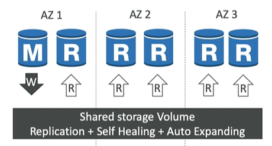

# Aurora (rdbms, Serverless)
- engine : `Postgres` 3x  and `MySQL` 5x
- serverless,**no capacity planning**
- global DB, 
- self-healing, 
- continuous s3 backup, 
- PITR, 
- scale to **128TB** 
- OLTP

## A. Advantages (other than )
- include rds adv.

###  1 Global Aurora
- cross `region` replicas in `less than a sec`. | single Database spans over multiple **region**.
- 1 Primary Region (read / write)
- Up to 5 secondary (read-only) in each region, `replication` lag is less than `1 second` :point_left:
  - Up to 16 Read Replicas per secondary region
  - **RPO**: less than second
  - **RTO**: less than a minute
- 

###  2 integration **ML service** 
- `SageMaker` and `Comprehend`
- fraud detection, ads targeting, sentiment analysis, product recommendations

### 3 Auto-scaling (storage and compute are separate)
- `storage` scaling :: EBS volume - `10 GB to 128 TB`
- `compute` Instance :: type( eg: d.r3.large,etc), --RAM++, --cpu++.
- `Read replicas`:  (built-in, dont need to create CW + ASG, auto happens bts)
  - can add, CW metric --> triggers --> auto up/down read replicas
   
### 4 performance
- AWS cloud optimized and claim `3x` Performance improvement (on Postgres)
- master + `6-15` Read Replica, with **fast replication**
- uses **cloning**
  - faster than backup > restore
  - uses `copy-on-write` - use same volume + for new changes additional storage allocated and data copied to it.
  
### 5 Availability (cluster arch)
- `6 copies` for data access 3 AZ : `cluster` ( with reader and writer endpoint)
- instant fail-over (<30s) + `self healing` from peer2peer replication.
- 
- 

### 6 more
  - Isolation and `security`
  - `Industry compliance`
  - Push-button `scaling`  
  - Advanced Monitoring
  - Routine `Maintenance` + Automated `Patching` with Zero Downtime
  - Backtrack: `restore` data at any point of time without using backups. (earliest :`5 mim ago`)

---
## B pricing
- 20% extra cost than RDS.

---
## C. demo
```
- select engine
- select versions (so many available)
- template - prod (allow to configure everything)
    - admis + password
    - max i/o or standard
    - ec2 instance or serverless
    - choose : avialability - replica,etc
    - vpc, subnet, Ibv4
    - public access
    - sg
    - port
    - authentication
    - db name
    - ...

=== READY ====

- add more read replica
- add cross az replica 
- add region (global database)
- horizontal scaling policy (trigger : metric -CPU usage)
    - max 15 and min 1
    
```