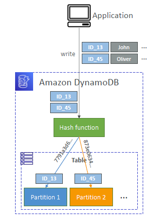
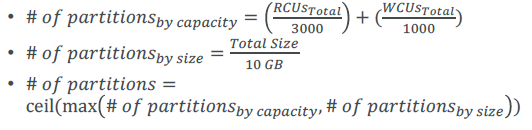
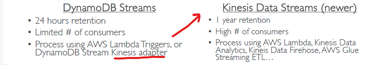
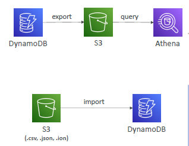

# DynamoDB (serverless)
## A. Intro
- **No Sql** 
  - unstructured
  - rapidly evolve schemas
  - All the data that is needed for a query is present in **one row**
  - don’t perform **aggregations** such as “SUM”, “AVG”, …
  - **scale horizontally** :point_left:
  
- **Fully managed** 
  - no maintenance/patching
  - no db admin
  - no provisioning db

- **high consistent performance DISTRIBUTED database** :point_left:
  - `single-digit millisecond performance`, at **any scale** 
  - `Millions of requests` per seconds
  - `trillions of row`
  - `100s of TB` of storage
  - Scales to `massive workloads`

- Allows event driven programming with **DynamoDB Streams** :point_left:

---
## B. Distributed DB (highly available)
### 1. Traditional relational DB:
- **Vertical scaling** (getting a more powerful CPU / RAM / IO)
- **`limited` Horizontal scaling** 
  - increasing Read Replicas.
  - but limited. eg max 16 read replica/s.

### 2 `Single-region` Table
- table data stored in multiple partitions.
- **hashing algorithm**( on PartitionKey) ==> decides which partition  to go.
- **partitionKey**
    - `unique`
    - `diverse`, to distribute data evenly on partition.  :point_left:
  
#### Partition
- 
- dynamoDB
  - table-1
    - **partitions-1** (node-1) <--> **2 way multiple-AZs replication** <--> partitions-1(node-2)
      - both can Read and Write
      - no leader/primary concept.
    - **partitions-2**
    - ...
    - ...
    - scale out more partition/s
    
- Number of partitions
  - 
    
### 3. `Global Table`
- table-1 (R/W) is `region-1`
- table-1 (R/W) is `region-2`
- `2 way replication` b/w both regions.
- 
- Side Note: `Enable` **DynamoDB Streams** first,  helps to replicate data across replica tables in other AWS Regions

---
## C. DynamoDB streams
- some usecase:
    - `React` to changes in real-time by invoking `lambda`,` KCL-adaptor(Java-App) `
    - Real-time usage `analytics` : send stream to `AmazonShift`
    - Implement cross-region `replication`
- 
- 

---
## D. Storage 
- storage classes ( like in s3 ): 
  - **Standard**
  - **Infrequent Access (IA)** 
    - to save more cost

---
## E. Security
- Integrated with IAM for security, authorization and administration
- encryption at rest/fly

---
## F. DR
- **Automatic backup** for last `35 days`. 
- take ondemand backup for longer retention.
- Enable Cross-region copy. no performace impact/ downtime.
- PITR - point in time recovery
- `export` (json,ion) data --> S3.
- `import` (json,csv,ion) --> Dynamo DB
- 
