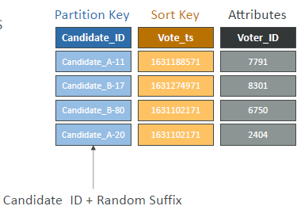
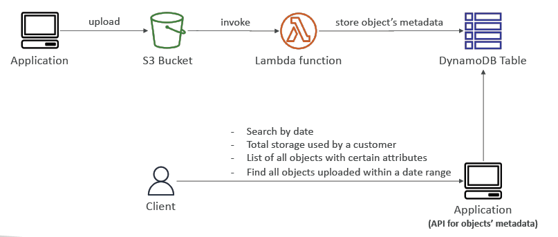
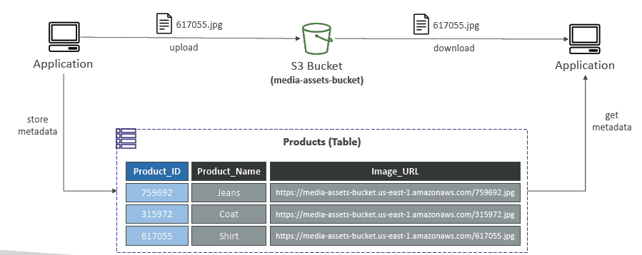

- https://chatgpt.com/c/675f4a6d-26b8-800d-b73e-a01c28a386b2
--- 
# DynamoDB (serverless)
## A. Intro
- **No Sql** 
  - unstructured
  - rapidly evolve schemas
  - All the data that is needed for a query is present in **one row**
  - don’t perform **aggregations** such as “SUM”, “AVG”, …
  - **scale horizontally** :point_left:
  
- **Fully managed** 
  - no maintenance/patching
  - no db admin
  - no provisioning db

- **high consistent performance DISTRIBUTED database** :point_left:
  - `single-digit millisecond performance`, at **any scale** 
  - `Millions of requests` per seconds
  - `trillions of row`
  - `100s of TB` of storage
  - Scales to `massive workloads`

- Allows event driven programming with **DynamoDB Streams** :point_left:

---
## B. Distributed DB (highly available)
###  Traditional relational DB:
- **Vertical scaling** (getting a more powerful CPU / RAM / IO)
- **`limited` Horizontal scaling** 
  - increasing Read Replicas.
  - but limited. eg max 16 read replica/s.

### 1. DynamoDB: `Single-region` Table
- table data stored in multiple partitions.
- **hashing algorithm**( on PartitionKey) ==> decides which partition  to go.
- **partitionKey**
  - `unique`
  - `diverse`, to distribute data evenly on partition.  :point_left:
    - add **suffix** to partition key to make it more n more diverse.
    - this is called **write sharding**.
    - so use random. calculated suffix.
    - 
  
#### Partition
- 
- dynamoDB
  - table-1
    - **partitions-1** (node-1 in different az/s) <--> **2-way replication b/w AZ/s** <--> partitions-1(node-2)
      - both can Read and Write
      - no leader/primary concept.
    - **partitions-2**
    - ...
    - ...
    - scale out more partition/s
    
- Number of partitions
  - 
    
### 2. DynamoDB: `Global` Table
- table-1 (R/W) is `region-1`
- table-1 (R/W) is `region-2`
- **2-way replication b/w region/s**.
- 
- **Enable DynamoDB Streams** 
  - helps to replicate data across replica tables in other AWS Regions

---
## C. DynamoDB streams
- [udemy reference](https://www.udemy.com/course/aws-certified-developer-associate-dva-c01/learn/lecture/28646620#overview)
- **enable it explicitly** and select one of below **kind**:
```
• KEYS_ONLY           – only the key attributes of the modified item
• NEW_IMAGE           – the entire item, as it appears after it was modified
• OLD_IMAGE           – the entire item, as it appeared before it was modified
• NEW_AND_OLD_IMAGES  – both the new and the old images of the item
```
- internally has same concept of **shards**, same like in KDS :point_left:
  - we don’t provision shards, this is automated by AWS
  - [03_01_KDS_KinesisDataStream.md](../05_decoupling/03_01_KDS_KinesisDataStream.md)

- **Ordered** stream of **item-level modifications** (create/update/delete) in a table.

- has **24 hrs retention**, so process it or send it somewhere in that window , if needed.
  - read and process by directly **`Lambda fn`**
    - Define **event source mapping** [03_lambda-dva-02-trigger.md](../01_compute/03_lambda-dva-02-trigger.md#yellow_circle-c3-dynamodb--stream-)
  - send to **`KDS`** using **kinesis-connectors**
    - custom app ( aws-sdk or KCL) - read and process
    - KDA
    - KDF >> redshift / s3 / opensearch 
    - lambda fn
    
- **stream `Use cases`**
  - react to changes in real-time (welcome email to users)
  - Analytics
  - Insert into derivative tables
  - Insert into OpenSearch Service
  - cross-**region** replication 
    - if not using global dynamoDB

- **common architecture**
  - 
---
## D. Storage 
- max item size : `400 KB`
- storage classes ( like in s3 ): 
  - **Standard**
  - **Infrequent Access (IA)** 
    - to save more cost
- storing large object in dynamoDB.
  - use **s3** to storage
  - in table store s3 metadata.
---
## E. Security
- encryption at rest/fly by KMS/TLS
- **Resource-based policy** for table.
- keep traffic inside vpc
  - create **vpce** / gateway (privateLink)
- Integrated with IAM
  - use **Identity provider** 
  - federated user
  - Assign an **IAM Role** to federated user with a **Condition**:
    - to limit their API access to DynamoDB
    - **dynamodb:`LeadingKeys`** == partition_key or partition_key_prefix
      - row level access. 
      - user can access row with that partition_key
    - **dynamodb:`Attributes`**
    ```json5
    {
    "Version": "2012-10-17",
    "Statement": [
        {
            "Effect": "Allow",
            "Action": [
                "dynamodb:GetItem",
                "dynamodb:Query"
            ],
            "Resource": "arn:aws:dynamodb:us-west-2:123456789012:table/YourTableName",
            "Condition": {
                "ForAllValues:StringEquals": {
                    "dynamodb:Attributes": ["name", "email"]
                }
            }
        },
        {
            "Effect": "Allow",
            "Action": "dynamodb:UpdateItem",
            "Resource": "arn:aws:dynamodb:us-west-2:123456789012:table/YourTableName",
            "Condition": {
                "ForAllValues:StringEquals": {
                    "dynamodb:Attributes": ["status"]
                }
            }
        },
      
        
        {
            "Effect": "Allow",
            "Action": [
                "dynamodb:GetItem",
                "dynamodb:Query",
                "dynamodb:PutItem",
                "dynamodb:UpdateItem",
                "dynamodb:DeleteItem"
            ],
            "Resource": "arn:aws:dynamodb:us-west-2:123456789012:table/YourTableName",
            "Condition": {
                "ForAllValues:StringEquals": {
                    "dynamodb:LeadingKeys": "${aws:userid}"
                    //"dynamodb:LeadingKeys": "${aws:departid}_*"
                }
            }
        }
    ]
    }
    ```

---
## F. DR
- **Automatic backup** for last `35 days`. 
- take ondemand backup for longer retention.
- Enable Cross-region copy. no performace impact/ downtime.
- PITR - point in time recovery
- `export` (json,ion) data --> S3.
- `import` (json,csv,ion) --> Dynamo DB
- 

## G. Migration
- use **AWS DMS** to dynamoDB from:
  - MongoDB
  - SQL database : MySQL,Oracle, etc
    - de-normalize
    - convert to item

## H. Architecture example:
- use dynamoDB for indexing S3 metadata.
  - 
  - 
