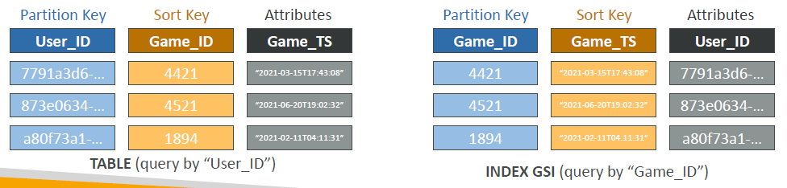
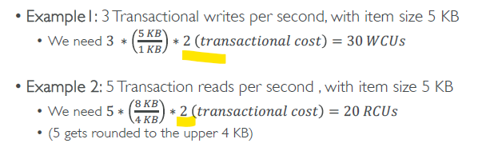

# A. DynamoDB - `components` :books:
## 0. **Table**
- PK : **partitionKey** , or
- PK : **partitionKey** + **Sortkey**
- 
- Also, define **mode** for read/write operation:
  - `provisioned` - define **capacity** `RCU / WCU `
  - `onDemand` - uses `RRU / WRU` **requests**, internally. 2.5 times expensive.
  - can switch b/w modes, at any time :point_left:
- created : https://us-west-2.console.aws.amazon.com/dynamodbv2/home?region=us-west-2#table?name=ps-games

## 1. **Record**
- or Item
- has attributes (`400 KB max`)

## 2. **Datatype**
- **Scalar Types** – String, Number, Binary, Boolean, Null
- **Document Types** – List, Map
- **Set Types** – String Set, Number Set, Binary Set

## 3. **TTL** 
- set expiration for record / item
- it will auto-delete and send event stream
- eg: 
  - enable TTL setting and give attribute name : `my_expire_on`
  - add **attribute** : `my_expire_on ==  <timeinMillisecond>`
  - expired after 2 hr
  - and deleted from index - LSI and GSL 
  - and after `48 hrs`, **permanently deleted** from main table also. (for recovery purpose)
  - eg: webUser --> session 2 hr --> session logout --> expire his/her data after 2 hr.

## 4. **Write Capacity Units** (**WCU**)
- `1 WCU` == write `1 item`(`upto 1 KB`)/`sec`
- 

## 5. **Read Capacity Units** (**RCU**)
- **2 types of read**
  - ConsistentRead == True
    - 1 RCU ==  1 **`Strongly` Consistent Read** of 1 item(`upto 4 KB`)
  - ConsistentRead == false (default)
    - 1 RCU ==  2 **`Eventually` Consistent Read** of 1 item(`upto 4 KB`)
- 
  - because of replication lag, can be Strongly or Eventually consistent
- 

---
## 6. Define **throughput** for **each table**
### 6.1. **On-Demand Mode** 
- read/write operation, automatically scale up/down upto its max, with growing workloads
  - Read **Request** Units (RRU)
  - Write **Request** Units (WRU)
- for un-predictable workload.
- simplified billing but `2.5 times expensive`

### 6.2. **Provisioned Mode** (default)
- for predicated workload
- can optionally, enable **auto-scaling** of WCU/RCU
- so we define **capacity** : RCU and WCU
- 
- 

### 6.3. **ThrottleError**
- if capacity exceeded then `ProvisionedThroughputExceededException`
- **reason**
  - `Hot Keys `– one partition key is being read too many times (e.g., popular item)
  - `Hot Partitions`
  - `Very large items`, remember RCU and WCU depends on size of items
- **Solutions**:
  - retry with Exponential backoff when exception is encountered (already in SDK)
  - configure autoscale of WCU/RCU - [ min,max,desired ]
  - Distribute partition keys as much as possible
  - If RCU issue, we can use **DAX**

---
## 7. PartiQL
- SQL-compatible query language for DynamoDB - CRUD
- no joins
- Run PartiQL queries from:
  - web Console
  - **NoSQL Workbench** for DynamoDB
  - CLI/SDK

---
## 8. Secondary Index
- [udemy reference](https://www.udemy.com/course/aws-certified-developer-associate-dva-c01/learn/lecture/28646582#overview)
### 8.1. `LSI` - Local Secondary Index
- index for : query by 
  - `same` **PartitionKey**
  - `Alternative` **SortKey**
-  **restriction**: 
  - `5 max`
  - Must be defined at table creation time 
- **Attribute Projections** :  KEYS_ONLY, INCLUDE, ALL
- Uses the WCUs and RCUs of the main table

### 8.2. `GSI` - Global Secondary Index
- index for : query by
  - `Alternative`  **PartitionKey**
  - `Alternative` **SortKey**
- Speed up queries on non-key attributes
- Can be added/modified after table creation
- **Attribute Projections** :  KEYS_ONLY, INCLUDE, ALL

- provision **new** WCU and RCU
  - If the writes are throttled on the GSI,
  - then the main table will be throttled! :point_left: :point_left:

---
## 9. transaction
- **ACID**
- **Read Modes** (query/scan)
  - Eventual Consistency 
  - Strong Consistency 
  - `Transactional`
    - Consumes 2x RCUs :point_left:
    - `TransactGetItems`
- **Write Modes**  ((add/update/delete))
  - Standard 
  - `Transactional` :point_left:
    - Consumes 2x WCUs
    - `TransactWriteItems`

---

## 10. store session states 
- It’s common to use DynamoDB to store session states
- compare with other cache option/s
  - **vs. ElastiCache**
    - ElastiCache is `in-memory`, but DynamoDB is `serverless`
    - Both are key/value stores
  - **vs. EFS**
    - EFS must be attached to EC2 instances as a network drive
  - **vs. EBS & Instance Store**
    - EBS & Instance Store can only be used for local caching, not shared caching
  - **vs. S3**
    - S3 is higher latency, and not meant for small objects