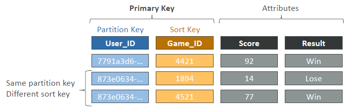
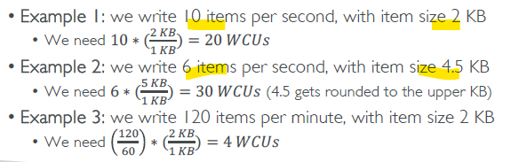
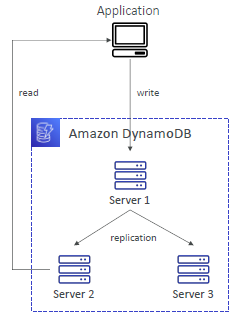
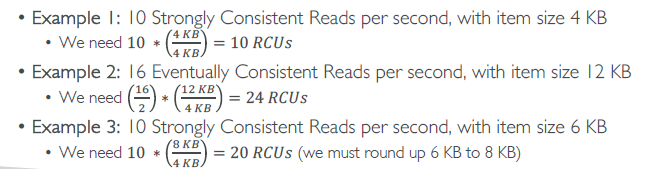
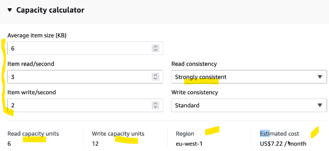
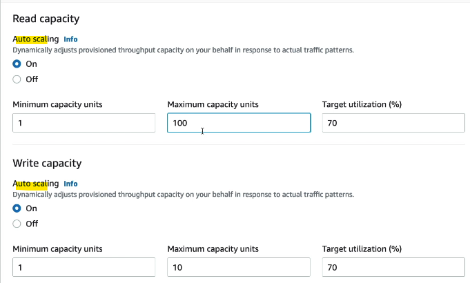

# DynamoDB - Developer things :books:
## 0. **Table**
- PK : **partitionKey** , or
- PK : **partitionKey** + **Sortkey**
- 
- also, define **mode** for read/write operation:
  - provisioned - define **capacity** RCU / WCU 
  - onDemand - uses RRU / WRU **requests**, internally. 2.5 times expensive.
  - can switch b/w modes, at any time :point_left:

## 1. **Record**
- has attributes (`400 KB max`)

## 2. **Datatype**
- **Scalar Types** – String, Number, Binary, Boolean, Null
- **Document Types** – List, Map
- **Set Types** – String Set, Number Set, Binary Set

## 3. **TTL** 
- set expiration for record
- it will auto-delete and send event stream
- eg: 
  - TTL is `2 hr`
  - webUser --> session 2 hr --> session logout --> cleanUp his/her data after 2 hr.

## 4. **Write Capacity Units** (**WCU**)
- `1 WCU` == write `1 item`(`upto 1 KB`)/`sec`
- 

## 5. **Read Capacity Units** (**RCU**)
- **2 types of read**
  - ConsistentRead == True
    - 1 RCU ==  1 **`Strongly` Consistent Read** of 1 item(`upto 4 KB`)
  - ConsistentRead == false (default)
    - 1 RCU ==  2 **`Eventually` Consistent Read** of 1 item(`upto 4 KB`)
- 
  - because of replication lag, can be Strongly or Eventually consistent
- 

## 6. Define **throughput** for **each table**
### **Provisioned Mode** (default)
- for predicated workload
- can enable optionally, enable auto-scaling of WCU/RCU
- so we define **capacity** : RCU and WCU
- 
- 

### **On-Demand Mode** 
- read/write operation, automatically scale up/down upto its max, with growing workloads
  - Read **Request** Units (RRU)
  - Write **Request** Units (WRU)
- for un-predictable workload.
- simplified billing but `2.5 times expensive`

## 7. **ThrottleError**
- if capacity exceeded then `ProvisionedThroughputExceededException`
- **reason**
  - `Hot Keys `– one partition key is being read too many times (e.g., popular item)
  - `Hot Partitions`
  - `Very large items`, remember RCU and WCU depends on size of items
- Solutions:
  - retry with Exponential backoff when exception is encountered (already in SDK)
  - Distribute partition keys as much as possible
  - If RCU issue, we can use **DAX**

---
## 99. hands
```
- create db - no such thing :_)
- create table-1
    - choose : partition key (hash value used to retieve from table)
    - choose : sort key (optianal)
- capacity:
    - a. on-demand: simple, expensive 
    - b. Provision ** 
        - RCU
            - option-1 (scale-on) min-1 , max-100 , 70% utlization
            - option-2 (scale-off) capicity: 1
        - WCU
            - option-1 (scale-on) min-1 , max-100 , 70% utlization
            - option-2 (scale-off) capicity: 1
- indexing : pending
- Encryption (3 key options ) : dynamoDB-ownedKey, AWS-KMS, customerKey

- create item/record
    - record-1 : add attribute1,2,3,4    
    - record-2 : add attribute1,2
    - no schema :)    
```