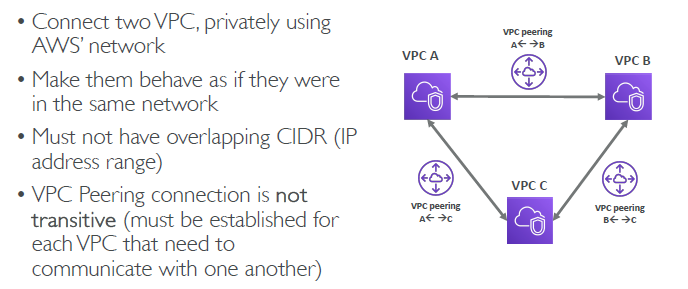
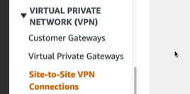

```
  - network:0 - AWS VPC-1 (vpc)
  - network:1 - internet (public internet)
  - network:2 - Corporate Network (VPN)
  
  - vgw == `Vitual-private GateWay` 
  - cgw == `Customer gateway` / software+hardware, running on customer side / attached `NAT-device`(public-IP-1)
```
# Network topologies
## A. AWS::VPC <==> AWS::VPC
### A.1. `AWS::VPC-1` to `internet`
```
network:0,AWS VPC-1 (`rtb-main`) --> `igw`  --> network:1 : 
```
- create igw-1
- update rtb-main with igw-1 entry.

---
### A.2. VPC peering :: `AWS::VPC-1` to `AWS::VPC-2`
```
eg: 
 `Aws1::VPC-1` (CIDR-1)  <--- VPC peer ---> `Aws1::VPC-2` 
 `Aws1::VPC-2` (CIDR-2)  <--- VPC peer ---> `Aws1::VPC-3` 
 `Aws1::VPC-3` (CIDR-3)  <--- VPC peer ---> `Aws1::VPC-1` 
 
 # No "overlapping" CIDR among them.
 # not transitive
```
- point-to-point connection between **two** VPCs.
- establishes a `direct` network connection between two VPCs, enabling traffic to be routed between them using `private IP` addresses.
- Ideal for connecting `two` distinct VPCs, either within the same account or across different accounts, regions, or even AWS Organizations.
- Limited by the number of peering connections per VPC (up to 125 by default).
- 

---
### A.3. VPC `Sharing`
- allows multiple AWS accounts within the `same AWS Organization` to share the same VPC, managed by a central account.
- The owner account creates and manages the VPC, while participant accounts can provision resources in `shared subnets` of that VPC using AWS Resource Access Manager (`RAM`)
- `Resources` within the shared VPC can communicate with each other over `private IP` without additional configuration.
- Since all resources are within the same VPC, there are no additional data transfer costs. :)
- 

---
## B AWS::VPC <==INTERNET==> client::VPN
### B.1. AWS Site-2-site VPN 
- `AWS::VPC-1` to `Client-VPN-1`
```
- connect AWS::VPC-1 to Client-VPN-1

how:
AWS VPC-1 (rtb-main:vgw-1) <==> [ vgw-1 <---Site-2-site VPN(uses:internet)---> cgw-1 ] <==> network:2(customer-1) 
- this connection are `encrypted` by default.
- uses:internet
```
- Step-1: create **virtual gateway** `vgw-1`, and attached on AWS VPC-1 
- Step-2: create **client gateway** `cgw-1`, with customer details like - public-IP, etc
- Step-3: create **Site2Site VPN** to connect `cgw-1` with `vgw-1`.
  - **tunnels**
    - `tunnel-1` forward
    - `tunnel-2` backward
    - tunnel 1/2 == used for single connection
- Step-4: update `rtb-main` with vgw-1 : for traffic forwarding between networks.
- optional steps :
  - update sg on ec2.
  - update ACL on subnet.
- 
- 
- slow, then :  Transit Gateway with equal cost multipath routing and add additional VPN tunnels

---
### B.2. AWS VPN cloudHub
- `AWS::VPC-1` to [ `Client-VPN-1`, `Client-VPN-2`, ... ]
```
- connect **AWS::VPC-1** to **many Client-VPN/s**
  - Client-VPN-1
  - Client-VPN-2
  - ...
 
 # solution-1 - create Site-2-site VPN for each client. not managable for 100 of cleint/s.
 # solution-2 - VPN cloudhub    
    - uses:internet
```
- Step-1: create `vgw-1`, and attached on AWS VPC-1
- Step-2: create `cgw-1,2,3..`, with customer details
- Step-3: create `AWS VPN cloudHub(uses:internet)` - link `cgw-1,2,3,...` with `vgw-1`.
- rest of the step same as above.
- 

---
## C AWS::VPC <==DX==> client::VPN
### C.1. DX (Direct Connect)
```
# scenario
 - customer-1 is connected to DX-1::endpoint
 - AWS:VPC-1 wants to connect to same DX-1::endpoint
 
 flow:
 AWS VPC-1  (rtb-main:vgw-1) --> [ vgw-1 <--aws-direct-Location,DX::endpoint --> cgw-1 ] --> network:2(customer-1)
```
-  **AWS-Direct-location** between your on-premises and AWS, Bypasses the public internet.
  - **key-highlight**
    - dedicated physical connection
    - private 
    - high-bandwidth / fast
    - low-latency 
    - consistent/stable connection.
    - no encryption by default, can add but bit complex
    - fact:there is lead/wait time to setup new connection, around a month :point_left:
  - **Types**:
    - `Dedicated` : wire ethernet, `1,10,100 Gbps`, fastest
    - `hosted`    : via DX-partner `50 500 Mbps`, `1 2 5 10 Gbps`, slow
  - **resiliency** : 
    - add more connection/s.
    - 

- **Steps**:
  - Step-1: create `vgw-1`, and attached on AWS VPC-1
  - Step-2: create `cgw-1`, with customer details
  - Step-3: create `DX-1::endpoint`
    - connect vgw-1 to DX-1::endpoint
    - connect cgw-1 to DX-1::endpoint

- 

---
### C.2 DX gateway
```
# scenario
  - customer is connected to DX-1::endpoint
  - 2 or more AWS VPC wants to connect to same DX-1::endpoint
    - AWS::VPC-1 --> DX-1::endpoint
    - AWS::VPC-2 --> DX-1::endpoint
    - ...
    - ...
```
- **way-1** 
  - for AWS::VPC-1 
    - create `vgw-1` 
    - connect `vgw-1`to DX-1::endpoint
    - AWS::VPC-1 (update rtb:vgw-1) 
  - for AWS::VPC-2
    - create `vgw-1` for AWS::VPC-1
    - connect `vgw-1`to DX-1::endpoint
    - AWS::VPC-1 (update rtb:vgw-1)
  - ...
  - ...
    
- **way-2** : 
  - create DX-gateway  `dxg-1`
  - connect  `dxg-1` to DX-1::endpoint
  - AWS::VPC-1(update rtb:`dxg-1`) 
  - AWS::VPC-2(update rtb:`dxg-1`) 
  - ...
  - ...
  - 

---
### Scenario-4 :  DX with Site2SiteVPN(backup)
- create primary : DX
- create Secondary : Site2SiteVPN
- 


---
##  transient Gateway (video:344)
- network topolgies can be complicated 
- transient Gateway, simplify above topologies
- define everything at single place : rtb of transient gateway
- supports `IP-multicast` ?
- 
- create multiple tunnels in `AWS Site-2-site VPN` : `ECMP routing`
  - 
- shared with multiple aws account **
- AWS Transit Gateway with `Resource Access Manager` (RAM)

---
## Traffic Mirroring:
- Steps/use-case:
  - capture traffic (from Specific `source ENIs`) 
  - route/send to `ELB/NLB` or `target ENI` 
  - ec2-i(security appliance) 
  - perform inspection (threat monitoring, etc)
- 

---
## Summary
- `CIDR` – IP Range
- `VPC` – Virtual Private Cloud => we define a list of IPv4 & IPv6 CIDR
- `Subnets` – tied to an AZ, we define a CIDR
- `Internet Gateway` – at the VPC level, provide IPv4 & IPv6 Internet Access
- `Route Tables` – must be edited to add routes from subnets to the IGW, VPC Peering Connections, VPC Endpoints, …
- `Bastion Host` – public EC2 instance to SSH into, that has SSH connectivity to EC2 instances in private subnets
- `NAT Instances` – gives Internet access to EC2 instances in private subnets. Old, must be setup in a public subnet, disable Source / Destination check flag
- `NAT Gateway` – managed by AWS, provides scalable Internet access to private EC2 instances, when the target is an IPv4 address
- `NACL` – stateless, subnet rules for inbound and outbound, don’t forget Ephemeral Ports
- `Security Groups` – stateful, operate at the EC2 instance level
- `VPC Peering `– connect two VPCs with non overlapping CIDR, non-transitive
- `VPC Endpoints` – provide private access to AWS Services (S3, DynamoDB, CloudFormation, SSM) within a VPC
- `VPC Flow Logs` – can be setup at the VPC / Subnet / ENI Level, for ACCEPT and REJECT traffic, helps identifying attacks, analyze using Athena or CloudWatch Logs Insights
- `Site-to-Site VPN` – setup a Customer Gateway on DC, a Virtual Private Gateway on VPC, and site-to-site VPN over public Internet
- `AWS VPN CloudHub` – hub-and-spoke VPN model to connect your sites Direct Connect – setup a Virtual Private Gateway on VPC, and establish a direct private connection to an AWS Direct Connect Location
- `Direct Connect Gateway` – setup a Direct Connect to many VPCs in different AWS regions
- `AWS PrivateLink` / VPC Endpoint Services:
  - Connect services privately from your service VPC to customers VPC
  - Doesn’t need VPC Peering, public Internet, NAT Gateway, Route Tables
  - Must be used with Network Load Balancer & ENI
- `ClassicLink` – connect EC2-Classic EC2 instances privately to your VPC
- `Transit Gateway` – transitive peering connections for VPC, VPN & DX
- `Traffic Mirroring` – copy network traffic from ENIs for further analysis
- `Egress-only Internet Gateway` – like a NAT Gateway, but for IPv6 targets

---
## Cost / pricing (per GB)
- if 2 DB are in same AZ, replication cost will be less, but availability will be less.
- 
- `egress` - $ : AWS --> outside | `ingress` - free : outside --> AWS
  - 
- choose AWS direct location, close/same as your location/region-AZ
- 
  - s3 --> Cloudfront `free`
  - s3 --> internet + internet(accelerated) `9 cent, 9+4=13cent`
  - s3 --> region1:region2 (replication) `2 cent`
- 
  - prefer VPC-endpoint(s3-gateway) `1 cent`


