- https://chatgpt.com/c/6761df7b-aa90-800d-b11f-c0e411c511fe
--- 
# API gateway (Serverless)
## A. Intro
- **REST API** ( protocol : `http/s` + `websocket`), with other benefit:
  - **caching**
  - API **versioning**
  - API **documentation** / specification ?
  - **interceptor** : transform req/resp
  - more:
    - **No infrastructure** to manage. :)
    - create **environment**  - dev,qa,prod
    - **throttling** - rate limiting
    - **security** - check below.
    - **import**
      - already have pre-define API
      - from Swagger/OpenAPI
---
## B. API gateway: integration :books:
### B.1. **Backend**
- API-g >> PROXY >>**lambda** (event,context)
  - pure serverless
  - most common
  - default/max timeout : `29 sec`
  - use **AWS_PROXY**
    
- API-g >> PROXY >> **Any HTTP backend**
  - API-g >> **on-prem-API**
  - API-g >> **ALB**
    - expose ALB public directly. happening in ccgg.
    - expose API-g >> ALB > tg [ecs/eks - `container` - ec2/fargate]
      
- API-g >> PROXY >> **`Any` AWS service API call.**  
  - s3:*
  - sqs:getMessage
  - kds:* :point_left:
  - ...
  - note: setup **mapping template** :point_left:

---    
### B.2. **Proxy**
- there are 3 proxy options. choose either.
#### B.2.1. AWS_PROXY
- NO mapping template
- **request/response object** uses inbuilt aws-template
- eg: **API-g <==>    `AWS_PROXY`  <==> lambda**
- 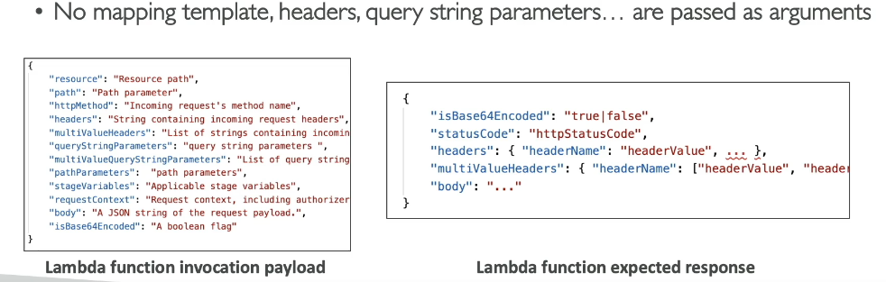
- Note: 
  - **ALB <==>         `AWS_PROXY` <==> tg:lambda**
  - use same template, remember
  - [01_ELB_ASG.md](01_ELB_ASG.md)

#### B.2.2. HTTP_PROXY
- NO mapping template
- eg: **API-g <==>  AWS_PROXY  <==> http-backend (`ALB`)**
- 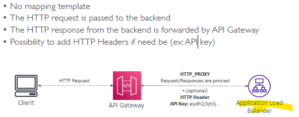

#### B.2.3. NO PROXY for (HTTP / AWS)
- set up mapping template
  - **Content-Type** must be == application/json/xml
- 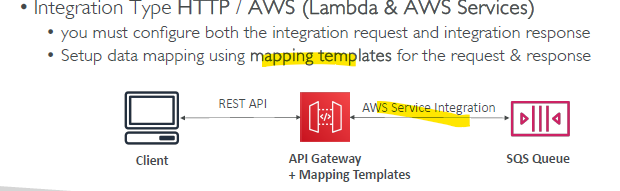

#### B.2.4. MOCK
- for dev/testing purpose

---
### B.3.  Mapping Template
- response from lambda
  - 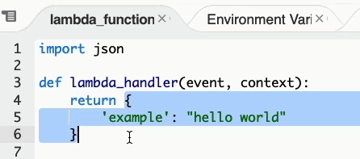
- create template
  - 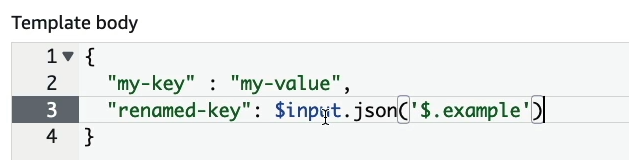
- check final response
  - 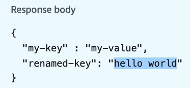
  
#### Use-cases
- **use-case-1**: transform SOAP response
  - 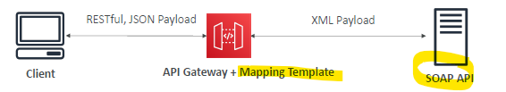
- **use-case-2**: tranform query param
  - 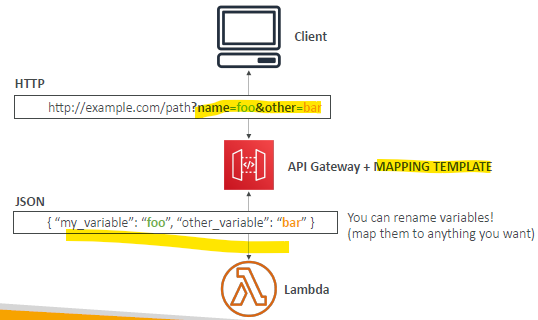

---  
## C. Endpoint type
- by **Deployment model** 
### 1 `regional`
- deployed in single region eg: us-west-1
- **for users in one region**
- can have **regional with CloudFont** eg:
  - set-1: for us-west-1
  - UNION
  - Set-2 : create CF distribution-1 (CF) : whiteList - europe user + india user

### 2 `edge-optimized` (default)
- deployed/lives in one region, but configure to
  - route request through CF many edge location/s
  - backed by : cloudFront distribution
- **for global user**

### 3 `private`
- with private VPC
- API-g >> **VPC endPoint**

---
## B. Security
### 1. Authentication + Authorization
#### 1.1. API keys
- **Authentication**
  - pass`x-api-key` header
- **Authorization**
  - API-gateway **resource iam policy** === for
  - who and what, they access on API-gateway. same like s3 policy, sqs policy, lambda resource policy, etc.
  - principle/who:
    - use for **cross account id**
    - ...
    
---    
#### 1.2 IAM
- 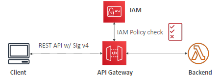
- for IAM user / roles
- **Authentication** 
  - **IAM-based SigV4 signing** 
  - AWS SDKs and AWS CLI handle SignatureV4 signing automatically.
- **Authorization**
  - same, IAM policy
  
---  
#### 1.3 Cognito
- for global user
- **Authentication**
  - integrate with 3rd party ID provider.
  - 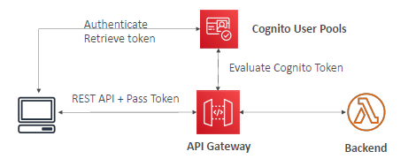
- **Authorization**
  - API-g >> proxy >> lambda (resource policy for authorization) : point_left:
  
---  
#### 1.4 Lambda Authorizer
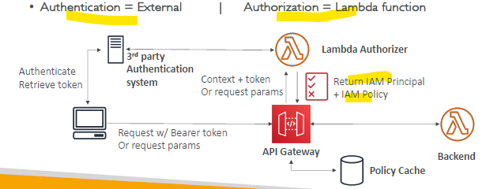
- Great for 3rd party tokens
- Handle Authentication verification + Authorization in the Lambda function

--- 
### 2 SSL
- export certificate to **ACM**
- create **R53** entry (cname/alias)
  - integrated with ACM
  - keep certificate it `us-east-1` for edge-optimized endpoint.
  - certificate with backend server domain name.

### 3 CORS
- CORS can be enabled on api gateway
- eg:
  - 

### 4 **`throttle` setting** for stage
- set **rate** (no.of req per seconds make be made)
  - `10000 rps `across all APIs :point_left:
  - set limit for stage. :point_left:
  - else one api/stage will consume all and impact other
- set **burst** (no of concurrent request)

### 5 **`firewall` setting** for stage
- set WAF
- set certificate

### 6. create usage plan

---
## C. pricing

---
## Y. hands on
```
- create (4 Type) : api-gateway-1
    - HTTP API  >> lambda, http backend
    - REST API | REST API (Private,vpc-1) >> lambda, http backend, awsServices
    - Web-scoketAPI  >> lambda, http backend, + awsServices
    
  - choose - REST API
  - API details:  
        - create new **
        - import frpm OPen/AI swagger
        - clone API
  - deplomnet model : regional 
        - region : us-east-1
  - integration Type: lambda
        - choose method: lambda-fn-1
        
  - set timeout : default 30 s
  
  - check lambda > permission > "resource based policy statemnet" 
    - allow invoke for agi-g          <<<<
        
  - proxy integration : enabled       <<<<                
    - if not enabled
    - then create mapping template
        
  - invoke from aws webcosole
  
  - Deploy API
      - choose stage - dev,qa, prod
      - will get invoke URL
      - try on BROWSER
```

---
## Z. Architecture Example
- 
- 
- 
