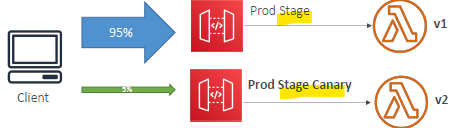

# API-gateway :books:
## 1. Stage and deployment

- once created API-g, need to deploy it on **stages**
  - give stage a **name** -dev,qa,prod,whatever
  - stages has **deployment history** 
    - stage can be **rollback**.
    - so think of `deploymnet object in k8s`
  - has **stage variable**, for dynamic configuration for stages. eg:
    - lambda-arn
    - http-endpoint-uri
    - ...
    - note: passed to **context** object. => lambda.handler(event,`context`) :point_left:
    - format **${stageVariables.`var-1`}**
    
### 1.1. example:
```yaml
    - api-gateway-1:
      - integrated with lambda-1 arn ==> xxxx:${stageVariables.`lambda-alias`} 
        - created one stage variable
        - similarly create more stage variable.
      - set value of stageVariable "lambda-alias" in all stages, then
      - stages:
        - dev-1
          - set lambda-alias: dev
          - dev is point to $LATEST
        - qa-1
          - set lambda-alias: v10
```
### 1.2 Configuration
- **`cache` setting**
  - cache request/response
  - provision **size**
  - set cache object **TTL**
- **`throttle` setting**
  - set **rate** (no.of req per seconds make be made)
  - set **burst** (no of concurrent request)
- **`firewall` setting**
  - set WAF
  - set certificate
- **`logs/trace/metric` setting**
  - `CW:logs` : enable/disable
    - error only
    - error + info
    - full req + response log
  - `CW:x-rays` : enable/disable
  - `CW:metric` : enable/disable
  
### 1.3 canary deployment

- api-gateway-1
  - stage-1 (`95 %` traffic) : monitor-1
  - stage-2 ( `5 %` traffic) : monitor-2
- console >>  **canary tab** 
  - set above configuration.

---
## 2. documentation

---
## 3. integration

---
## 4. Open API

---
## 5. caching

---
## 6. usage plan and API keys

---
## 7. Monitor