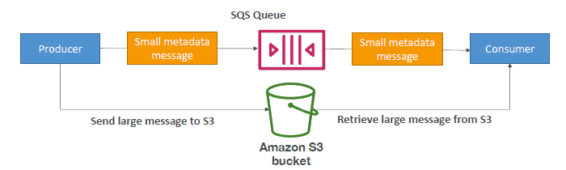
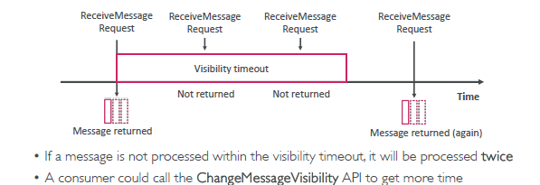
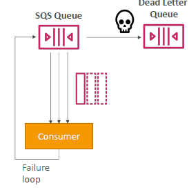
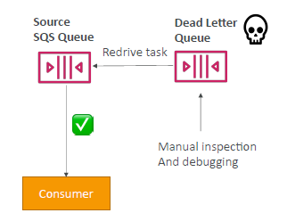
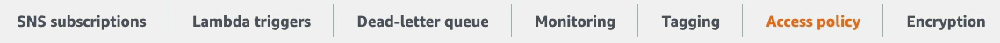
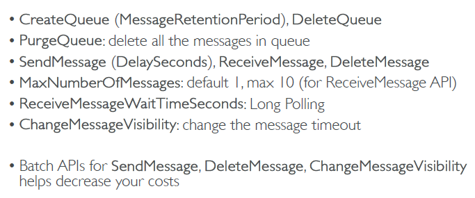
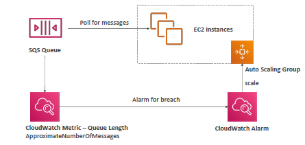
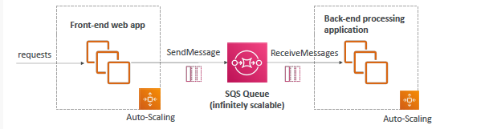
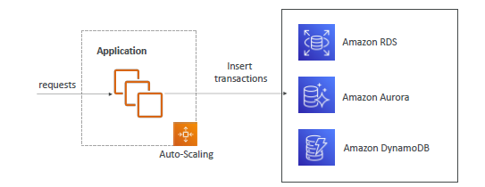

# SQS 
- oldest & Fully managed  
- auto-scale
- unlimited throughput,  
- low latency (< 10ms), 
- max msg size : **256KB** :books:
  - use extended-SQS, backed by s3.
  - 
  
## A. De-couple Models in AWS
  - `queue` :  **SQS** 
    - coupled app (sync) 
    - de-couple app (Async)
  - `pub/sub` : SNS
  - `real time data-stream` : kinese Firehose
---
## B. Types
### 1. Standard 
- **multiple producer** p1,p2,p3, ...  ---> [queue:message-1(with Attribites)] ---> **multiple consumers** (C1,C2,C3, lambda-Consumer, ... )
  - can purge 
- **at least once delivery**  
  - multiple consumer can receive same message.
  - consumer handle duplicate message, has to delete message.
  - idempotent consumer, if needed.
- **best effect ordering**
  - order not guaranteed.
- **retention**: 
  - max     : `14 days` 
  - default :  `4 days`
- **visibility timeout** :o:
  - 0-12 hr
  - consumer could call this api to get more time.
  - 
  - if too low, then may get duplicate.
- **Long polling**  :o:
  - Consumer can optionally “wait” for messages to arrive, if there are none in the queue 
  - set `message receive wait time` : (1-20 sec)
  - pattern : poll-1 API -- wait 10 sec -- poll-1 API -- wait 10 sec ...
  - long poll **preferred** : more gap in poll api calls, but increase **latency**
    - save cpu cycle, save money.
- DLQ must also be a standard queue
- **Delivery delay**

### 2. FIFO
- name : has suffix `.fifo`
- keep single consumer
  - if having multiple consumer, then use group messages: `msgId + groupingId`
  - group-1 ( msg1, msg-2, ...) --> consumer-1
  - group-2 ( msg1, msg-2, ...) --> consumer-2
- **ordered** + **no duplicate consume**. :point_left:
- but, Limited **throughput**: 
  - `300 msg/s` without batch
  - `3000 msg/s` with batch
- DLQ must also be a FIFO queue
---
## B. DLQ
- 
- If a consumer fails to process a message within the Visibility Timeout…
  - then. message goes back to the queue and consume received again.
- After the **MaximumReceives threshold (say 3)** is exceeded,
  - message goes into a `Dead Letter Queue `(DLQ)
- Good to set a retention of 14 days in the DLQ
- **re-drive** 
  - push messages from the DLQ back into the `source queue / any other queue`
  - 
---
## C. Security 
### general
- attach iam:sqs-policy.
  - cross account access
  - allow other service: 
    - eg: S3 Event Notifications To SQS Queue
- **In-flight encryption** 
  - `HTTPS` (with TLS)
- **At-rest encryption** 
  - KMS keys (`sse-sqs`, `sse-kms`, `sse-c`)
  - Client-side encryption :  if the client wants to perform encryption/decryption itself.
- `SQS bucket policy` : eg: 

---
## D. price (cheap)
- **number of requests** 
  - Standard Queue : `$0.40 / million requests`.
  - FIFO Queue : `$0.50 /  million requests`.
- **data transfer**
  - inbound data is free
  - outbound traffic paid. ?
- Long Polling: No extra cost for long polling.

---
## E. hands on
```
- create queue : queue-1
- Type : standard ** + FIFO
- configuration:
  - `visibility timeout` : 30
  - `delivery delay`
  - `receive message weight time`
-  encrytion : sse-sqs
- policies:
    - SQS access policy : json
    - Redrive allow policy : pending
- Dead-letter queue
- tags

// READY
- send : hellow world
- receive : poll messages + delete
- purge : delete all message.
```
- 

---
## F. API must know (for DVA) :books:

---
## G. use-case / arch eg
1. `SQS:queue:logs` >> CW >> metric >> alarm --> ASG [ ... multiple consumers ec2-i... ]
  - 
2. ASG [ FE-1, FE-2, ... ] ---> stage all request in Queue --- > ASG [ BE-1, BE-2, ...]
  - 
3. Overloaded DB request:
- ASG [ FE-1,...] --> Queue-1(Stage client request) --> ASG [BE-1,...] --> store to DB, OVERR-LOADED --> `lose some insert`
- ASG [ FE-1,...] --> Queue-1(`Stage client request`) --> ASG [BE-1,...] --> Queue-2(`stage-DB-request`) -->  ASG [BE-repo-1,...]
- 
- 

