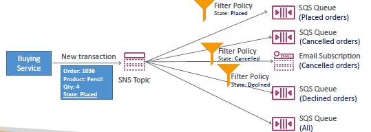
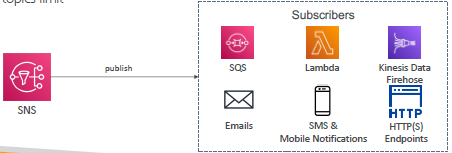
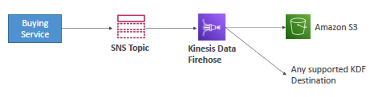

# SNS 
## A. key point
- **pub-sub model**
- 
- `100k` topics, per account, can be extended.
- **type**
  - Standard 
  - FIFO
- **subscription**
  - max: 12 million
  - subscription with **filter policy** 
    - filter message by **message attribute**
    - 

---
## B. Subscriber/s 
- KDF
- 

---
## C. publisher/s
- 

---
## D. Security
### general
- attach iam:sns-policy.
  - cross account access
  - allow other service
- **In-flight encryption**
  - `HTTPS` (with TLS)
- **At-rest encryption**
  - KMS keys (`sse-sqs`, `sse-kms`, `sse-c`)
  - Client-side encryption :  if the client wants to perform encryption/decryption itself.

---
## E. use case
- SQS + SNS **fan out pattern**
  - 
  - 
  - 
