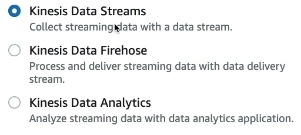
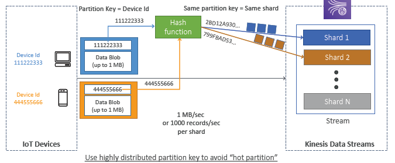
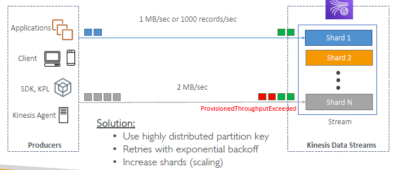
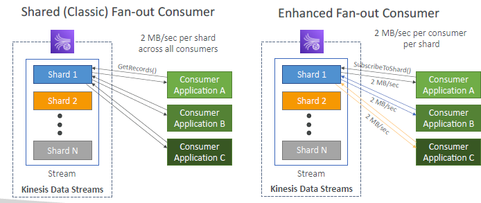
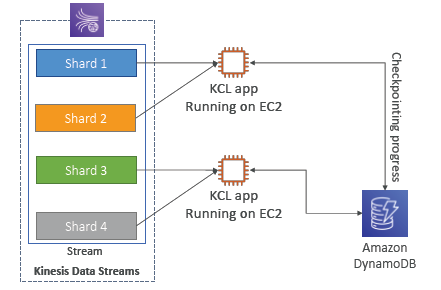
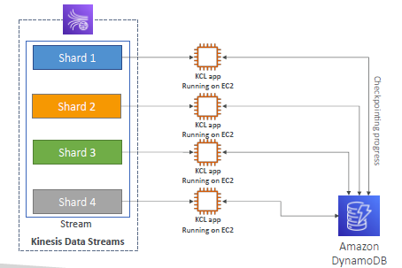
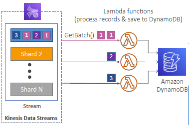
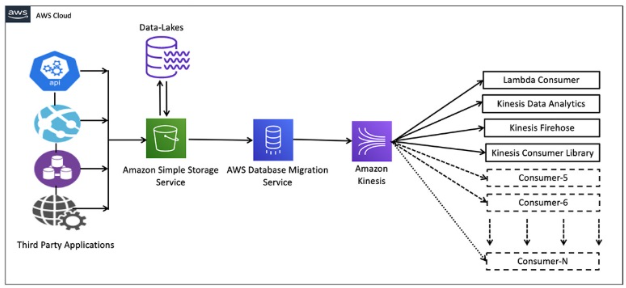

- 
- real-time **stream**. eg:
  - app log
  - CW metric
  - web activity
---
# A. Kinesis Data Stream `KDS` (serverless)
- think of [kakfa](../../06_messaging/kakfa)

- **serverless**
  - manages the infrastructure
  - storage
  - networking,
  - configuration needed to stream data.
  
## 1. key feature
- ingest data at scale 
- real-time processing
---
## 2. component
- 
- 

### A **kineses stream**  === topic
  - retention : 1 - 365 days (immutable) : use to replay

### B **shards** --> shard-1, shard-2, ...
  - shard count decides:
    - message/record throughput :` 1000 record/sec/shard` : if 6 shards => **6000 message/sec**
    - produce speed : `1 MB/sec/shard ` : if 6 shards => **6MB/s**
    - consume speed : `2 MB/sec/shard`  : if 6 shards => **12MB/s**
  - order : data in each shared is ordered.

### C **record**  (message)
  - shard#,
  - `Blob`(data) 1MB-max
  - `partition-key` : msg with same key goes to same shard.
    - use highly distribute key, else imbalance and **ProvisionThroughputExceeded** error :point_left:
    - fix:
    - a. do retry with exponential backoff.
    - b. scale shards.
    - 
    - 

---
- 
---

### D **producer** : 
#### app
  - **aws SDK** (for simple producer)
  - **KPL** - kineses producer lib 
    - for adv usecase : `compression`, `batch`, etc. 
#### **kineses-Agent** : stand-alone java programs

### E **consumer** :books:
#### a. app(aws SDK) 
- **classic fan out consumer/s** (pull): 
  - 3 consumer on shard-1, then throughput will 2MB/sec/3 == 666KB/sec each
  - getRecord API
- **enhanced fanout consumer/s** (push using HTTP/2)
  - subscribe API
  - sift limit of 5 consumer per stream.
- 
- 

#### b. app(Kineses Client libray)
- java lib
  - kcl v1 (shared)
  - kcl v2 (shared + enhanced)
- read progress is tracked in **dynamoDB**. so add IAM role. :point_left:
- max one KCL consumer per shard only :point_left:
  - 
  - 

#### c. lambda
- supports both mode 
  - classic 
  - enhanced
- configure these : `batch size` and `batch window`.
- eg: serverless flow
  - 
  
#### d. **kDF (firehose)** :point_left:
- [03_02_KDF_KinesisDataFirehose.md](03_02_KDF_KinesisDataFirehose.md)

#### e. **KDA (analytics)** :point_left:
- [03_03_KDA_KinesisDataAnalytics.md](03_03_KDA_KinesisDataAnalytics.md)

--- 
## 3. capacity planning (stream>shard)
### **provisioned**
  - choose shard count needed.
  - cost - hourly `/shard` : 0.015

### **on-demand** new
  - default capacity: `4000 record/sec + 4 MB/sec`
  - **auto-scale** shards based on last 30 throughput peek **history**
    - max: `200k record/sec + 200 MB/sec`
  - cost 
    - hourly `/stream` :point_left: 
    - data in/out GB

---
## 4. security
- **authorization**: IAM polices
- **encryption** : at fly and at rest
- **monitor** API call with cloudTrail
- **vpc endpoint** for private connection.
  - 

---  
## 5. more
- S3 --> `DMS` --> kinesis
  - 

---
## 6 hands on
- https://www.udemy.com/course/aws-certified-developer-associate-dva-c01/learn/lecture/26101790#overview
```
aws kinesis create-stream \
    --stream-name <stream_name> \
    --shard-count <number_of_shards>

aws kinesis list-streams

aws kinesis describe-stream \
    --stream-name <stream_name>

aws kinesis delete-stream \
    --stream-name <stream_name>

aws kinesis put-record \
    --stream-name <stream_name> \
    --partition-key <partition_key> \
    --data <base64_encoded_data>

aws kinesis put-records \
    --stream-name <stream_name> \
    --records '[{"Data":"<base64_encoded_data>","PartitionKey":"<partition_key>"}, {...}]'

aws kinesis get-shard-iterator \
    --stream-name <stream_name> \
    --shard-id <shard_id> \
    --shard-iterator-type <type>
    
LATEST                : Most recent data.                         <<<<
TRIM_HORIZON          : Oldest data.
AT_TIMESTAMP          : Specific time.
AFTER_SEQUENCE_NUMBER : After a sequence number.

aws kinesis get-records \
    --shard-iterator <shard_iterator>
        
```