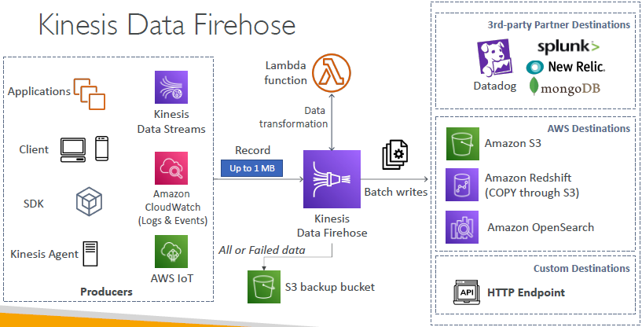

# B. Kinesis Data Firehose `KDF`
## 1 Intro
- **NearRealTime `Data Delivery streams`**
  - set **buffer-interval** `0-900 Sec`
      - if buffer-interval == 0 --> `real time`
      - if buffer-interval == 1 to 900 sec --> `Near real time`
  - set **buffer-size**
    - min : 1 MB
    - default : 5 min
    - KDF only buffers data, does not have any its own permanent storage.
      - no replay capbilty,
    
- **serverless**
  - fully managed, 
  - no administration, 
  - auto scale
  
## 2 Destinations
- 
- notice
  - optional lambda transformation + convert format to **parquet+ORC**
  - can put failed item into s3
  - write data in **batches**
  
### 2.1 AWS 
- only these 3:
  - `s3`
    - set compression + encryption
  - `redshift`
  - `OpenSearch`

### 2.2 3rd party
- splunk
- **datadog**
  - in ccgg, `cloudwatch::log/trace/metric` >>> `datadog`
  - doing with **sns** since not too much logs.
  - but if push everything, then go with KDF

### 2.3 http
- custom destination

---
## 3 source
- app(KPL/aws-sdk) === same for KDS
- KDS
---
# extra
