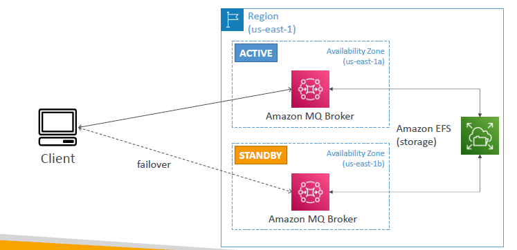

# Amazon MQ

- SQS, SNS are “cloud-native” services
- Traditional applications on-premises may use open protocols : MQTT, AMQP, STOMP
- migrate cloud
  - option-1 : re-engineer to SQS/SNS
  - option-2 : Use Amazon MQ to run rabbitMQ (AMQP)
- benefit: High avaliability:
  - 