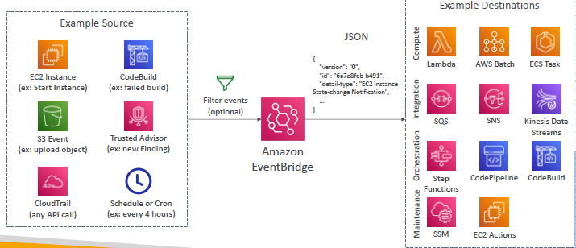
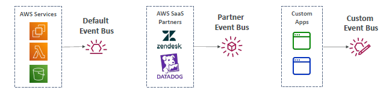
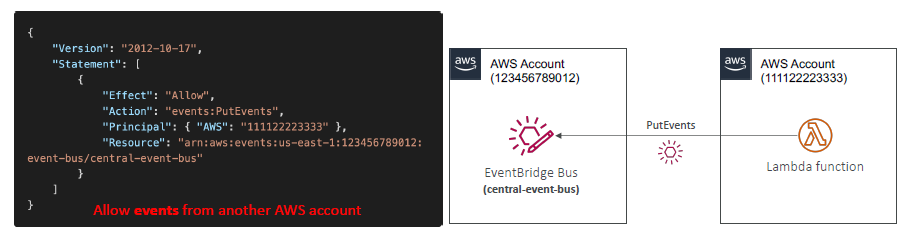
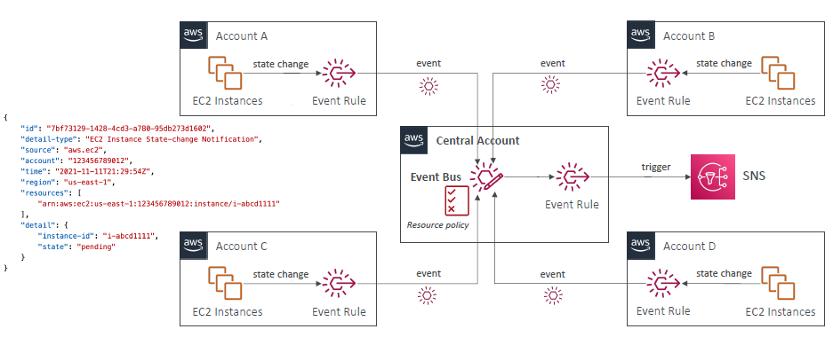

# Eventbridge

- aws1:custom-bus-1 (access policy) --> allow cross account access.
- archive event > replay event
---
## Architecture
### **central event bus**: 
  - AWS org (main account)
  - child aws will publish event to this bus
  - update IAM policy of bus, for cross acct access.
  - 
  - 

