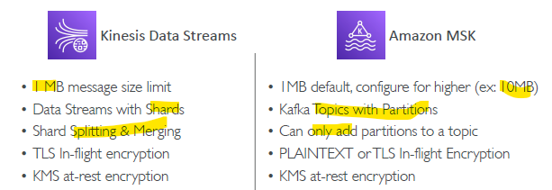
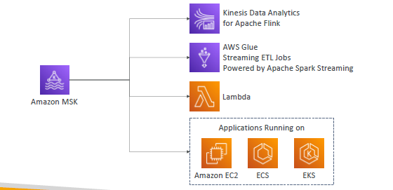

# MSK (Kafka)
## A. Intro
- Alternative to Amazon KDS.
- Fully managed **Apache Kafka** on AWS.
- **serverless**: 
  - Don't provision cluster capacity, 
  - resource, 
  - compute, 
  - storage,etc
- MSK regular, we provision:
    - Cluster
    - Kafka `brokers nodes` 
    - `Zookeeper` nodes
    - deploy in `Multi-AZ`
    - Data stored in `EBS` (as long as paying for volume)
    - `recovery` from failure
  
- `Consumer` : KDA(Flink), Glue, L, Prg( deploy on ECS,EKS,EC@)

---
## B. Screenshots
### Kafka

### Comparison

### Consumer

