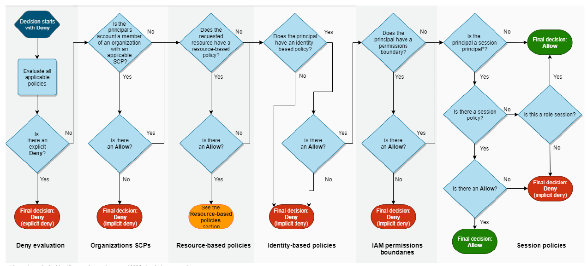
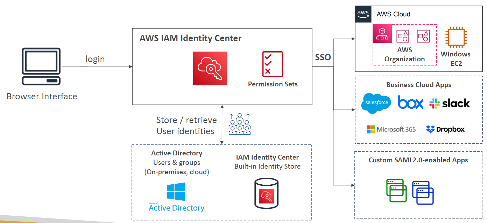

- IAM_01 https://chatgpt.com/c/3bfd592e-3ccc-403f-a61c-8e6ab72eacf5
---
# A. IAM
## 1. intro
- root user + MFA
- **IAM user** 
- **federated user** 
  - outside AWS user
  - authenticated by an external identity provider (okta,google,fb) using SAML,OIDC, OAUTH2.0
  - external identity provider, is register with AWS account
- **IAM Group**
- **policies** 
  - permission, JSON document 
  - Type: 
    - AWS managed policies (fullSQSaccess, fulls3access, etc)
    - customer managed polices
    - inline polices
- AWS CLI / SDK 
  - signed API call with **SigV4**
  - Access keys ID + secret Access key
- **Audit**: check below Reports
  - user level : **access advisor**, etc
  - account level : **credential report**, etc
---
## 2. IAM role
- Designed to provide temporary security credentials by **trusted entities/principle** 
  - other aws-service - ec2, s3,etc
  - cross account service/user 
- has 2 things:
  - **permission policy**
    - [ effect, action, resource, condition ]
  - **trusted entities** (role trust policy)
    - which principals (trusted entities) are allowed to assume the role.
- **use case**
  - service to service communication.
  - lambda role --> s3,sqs,etc
  - ecs/eks --> s3,sqs,etc
  - federated user, assumes role - Broad-access-role
  - service account in k8s assumes role (IRSA)
  - cross account access
    - create role for other account-2 to assume role and access rsource on account-1

---
## 3. STS : secure token service
### sts:assumeRole
- provides temporary security credentials(Access key + secret) + token(expiry)

### sts:assumeRoleWithSAML

### sts:getSessionToken
- equivalent to gimme-aws-creds
- get aws accessID,key,token,etc with MFA token
- add condition -> `aws:MultiFactorAuthPresent:true`
### sts:assumeRoleWithSAML

### sts:assumeRoleWithSAML

### sts:assumeRoleWithSAML

---
## 4. Resource Policy
- has **principle**
- who amd what are allowed to access : point_left:
- eg:
  - s3 policy
  - sqs policy
  - API gateway policy
  - ...

---
## 5. Permission Boundary
- json looks similar to policy.
- attach to Prinicple
- eg: boundary-1 : allow  `ecs,lambda,s3` only
  - attach to iam-user-1
  - iam-user-1 --> attach iam-policy(`sqs` access) 
  - iam-user-1 cannot access sqs, since its outside boundary. 
  - Can only be applied to roles or users, `not IAM groups`. <<<
  - used in AWS org.
  - 

---
## 6. scenarios
### 6.1. cross account access
- `AWS-1(user-11)` --> has to access -->  `AWS-2(resource : R1)` 

- **option-1** : `ResourceBasedPolicy`)
  - R1:Policy > update/add > allow AWS-1(user-11) 
  - :point_right: For S3,SQS,SNS,Lambda - use resource-based-Policy
  
- **option-2** : `IAM policy`
  - First, inside AWS-2 
    - create `role-1` >  allow AWS-1(user-11) to R1.
    - create `policy-1` : allow user-11 to assume `role-1`
  - Next, user-11 `assume role-1` and access it, but
    - user-11 will first `give up` all the original permission.
    - then assume/get role-1 permissions.
  - :point_right:for Kinesis Db - use iam role  
  

---
## 7. Evaluation logic :yellow_circle:

---
# B. Directory Service
## 1. Simple AD

- aws managed AD, users present only in this AD

## 2. AD Connector

- users present in on-prem AD, only
- `proxy` help to connect it.

## 3. AWS managed AD

- hybrid kind : user present in both : `AWS AD` + `on-prem AD`
- `AWS AD` create trust with `on-prem AD`

---
# C. SSO or Identity provider
- use case:
  - sso for all account in [aws org](./03_AWS_org.md)
  - sso for all ec2 instance in an aws account
- IP has : 
  - `AD : Active directory`  + integrate to `3rd party IP (OKta)`
    - [check here](#f-aws--ad-active-directory)
  - `permission set` : which user has access to what: `fine grained permission and assginmnet`
    - lek role-1(full-access) on  member-account-1
    - lek role-2(read-access) on  member-account-1
    - lek role-3(write-access) on  member-account-1
    - lek role-1(write-access) on  member-account-2
    
- Flow:
  - lek -> okta home  --> aws-mgt-acct:`AWS IP/SSO with permission-Set` --> `Okta SSO` 
    - member-account-1 > assume role-1, role-2, role-3
    - member-account-2 > assume role-1
    - how and where SAML fits ?

- 
- 
- 
--- 
- 

