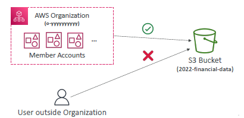

## Advance Polices
### Conditions
- Allow Access Based on IP Address
```
        {
            "Effect": "Allow",
            "Action": "s3:*",
            "Resource": "arn:aws:s3:::example-bucket/*",
            "Condition": {
                "IpAddress": {
                    "aws:SourceIp": "203.0.113.0/24"
                },
                // always AND
                "StringEquals": {
                        "aws:SourceVpc": "vpc-12345678"
                }
            }
        }
```

- Allow Access During Specific Time Period
```
            "Condition": {
                "DateGreaterThan": {
                    "aws:CurrentTime": "2024-07-19T09:00:00Z"
                },
                "DateLessThan": {
                    "aws:CurrentTime": "2024-07-19T17:00:00Z"
                }
            }
```

- Allow Access Based on MFA Authentication
```
            "Condition": {
                "Bool" / "BoolIfExist": {
                    "aws:MultiFactorAuthPresent": "true"
                }
            }
```

- tag
```
"Condition": {
                "StringNotEquals" / "StringEquals": {
                    "ec2:ResourceTag/Environment": "Production",
                    "aws:principleTag/Departmnet": "d1"
                }
            }
```
- more eg :
    - "aws:requestedRegion": "true"
    - "aws:priciplaOrgId": "0-xxxxxxxxx"
    - 