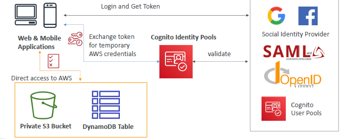

# Cognito (Serverless)
- > Complicated service, Need to have high level idea for SAA.
- Authenticate outside user - web/mobile app.
- `serverless database` to authentication+authorize outside user

---
## A. Cognito : user pool
- web/mobile user (`out-Side` AWS) --> `signIn user`.
  - simple login. 
  - password-reset, email/phone confirmation, MFA
  - integration with Other Identity provide: Okta,fb,google using `SAML`
  - send `auth-token`
- Already integrated with `ALB` and `API-gateway`.
  - so once user is signed, they can access ALB and API-gateway with auth token. 
  - 

---
## B. Cognito : Identity pool
- help to provide `temp AWS credential ( with fine grain permission)`, so outside user access aws resource directly.
- once user is signed-in with `Cognito : user pool` or `3rd party login`
- then, they exchange `auth token` with `AWS credential` 
- 

