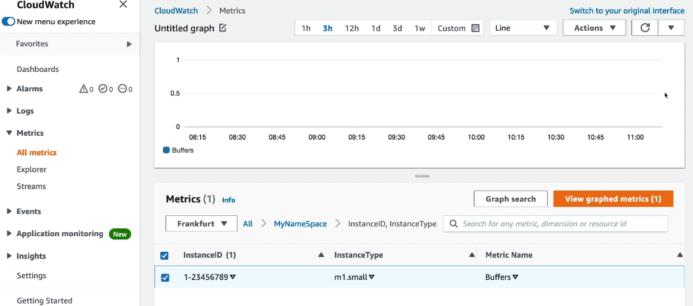

# Cloudwatch
## A. Cloudwatch : `Metric` :books:
- `namespace-1` : 
  - metric-1 : attribute/dimension-1, ... upto attribute-30. eg; instanceId,EnvName,etc
  - metric-2 : attribute/dimension-1, ...
  - ...
- `metric` are **variable** for monitoring
- **metric resolution** : how offer metric get run/refresh
  - `default` : 5 min.
  - `standard` : 1 min
  - `high` : 1/5/10/30 sec
  
### 1. Inbuilt metric
- metric enabled by default.
- can disable them.
- eg - for ec2:
  - `cpu utilization` 
  - `network call`
  - ...
  - NOTE: **ASG** uses these metric for auto-scaling.
    - change metric resolution to standard/high for better response :point_left:
  
### 2. Custom metric 
- can Define and Send **custom metric** on EC2 or any other service (eg- cw:log-group,etc)
- eg:
  - `RAM/memory utilization`
  - `disk utilization`
  - `number of logged User`
  - ...
  - ...
  - `log-metric-filter`
    - search pattern1 in log and create metric around it.
- Step-1 : Create it.
```
// 3. create log-metric-filter on log-group-1
log-group-1 > metric-filter tab
    - name: filter-1
    - namespace: filter-namespace-1
    - filter pattern : "error"
    - metric value : 100
    - so, when error found in metric will occur with value 100
```
    
- Step-2 : send
  - **PutMetricData** API
```
aws cloudwatch put-metric-data \
    --namespace <namespace-1> \
    --metric-name <metric_name> \
    --value <value> \
    [--dimensions <name=value,...>] \
    [--unit <unit>] \
    [--timestamp <timestamp>]

```
```
aws cloudwatch put-metric-data \
    --namespace MyApp/Performance \
    --metric-data file://metrics.json

# metrics.json    
[
  {
    "MetricName": "CPUUsage",
    "Value": 75.5,
    "Unit": "Percent",
    "Dimensions": [
      { "Name": "InstanceId", "Value": "i-12345678" }
    ]
  },
  {
    "MetricName": "DiskUsage",
    "Value": 60.0,
    "Unit": "Percent"
  }
]
```
### 3 dashboard
#### CW::dashboard
- check on AWS console
- check by region for ec2 or other service
- check by namespace
- 
  
#### external::dashboard
- create custom metric
- deliver the stream of metric data, using `KDF` to:
  - 3rd party : `datadog, splunk, dynatrace`
  - then use 3rd party dashboard

---
### extra
- metric eg:
  - **CPU** (active, guest, idle, system, user, steal)
  - **Disk metrics** (free, used, total), Disk IO (writes, reads, bytes, iops)
  - **RAM** (free, inactive, used, total, cached)
  - **Netstat** (number of TCP and UDP connections, net packets, bytes)
  - **Processes** (total, dead, bloqued, idle, running, sleep)