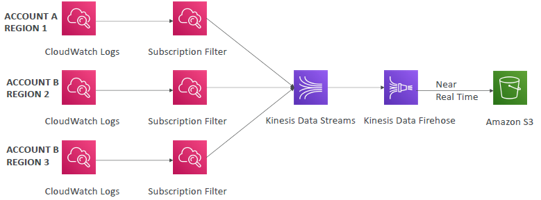
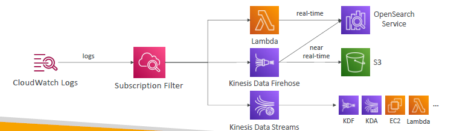

# Cloudwatch : `logs` :books:
- **expiration** policies
  - never expire
  - set 1 day to 10 years
- logs are **encrypted** by KMS

## 1 `log group`
- for each application create a log group

---
## 2 `Log streams`
- instance within log group

---
## 3 `export logs`
- **CreateExportTask** API
- destination:
  - **Amazon S3** : 
    - not real time
    - batch export 
    - takes up to `12 hrs`
  - KDS Kinesis Data Streams
  - KDF Kinesis Data Firehose
  - AWS Lambda
  - OpenSearch

---
## 4 `log source`
- **ECS/EKS**
  - container-agent : collect from containers
- **AWS Lambda**
  - lambda-agent : collect from function logs 
- **VPC Flow Logs**
- **Route53** 
- more:
  - API Gateway
  - Elastic Beanstalk : internal-app-agent
  - CloudTrail 
- `CloudWatch Unified Agent`
  - **log** + **metric**(ram.cpu.etc - at `granular` level)
- `SDK`
  - java/py app running on **EC2 / on-prem server** 
      

---
## 5 `log insight`
- 
- **query engine**
  - on historical logs-group on same/**cross**  aws account
- `log query >>> get result >>> export / visualize on CW::dashboard`
  - **purpose built query** language
  - find common query example on console itself.
  - fetch event, sort event, filter event, save and add to CW::dashboard.

---
## 6 `log subscription-filter`
- can create `max=2`
- **listener** to filtered log group.
  - can also to listen/subscribe to multiple same/cross account's log group 
  - and perform **log aggregation**:
  - 
  
- **listener action/s**:
  - do some processing with Lambda
  - deliver (KDF)
  - stream (KFS)
  - 

--- 
## ??
- **dashboard**
  - insight-rule-1 to ingest dashboard data
  - insight-rule-2
  - ...
- powered by `sagemaker`
- eg:
  - **lambda-insight**,
  - **CW-container-insight**
  - **app-insight**
  - **cw-contributor-insight**
    - build from `VPC logs`. etc
    - find heaviest n/w user, urlWithMostError, IPs,

---
## 99. hands on
```
- create lambda 
- run multiple time
- lambda "log-group-1" created :
    - log instance-1
    - log instance-2
    
// actions on  log-group-1 :
// 1. export to s3

// 2. create subscription-filter (max=2)
action: KDF > S3
    
// 4 . create log-stream-1 from log-group-1 > start live tail
...
```