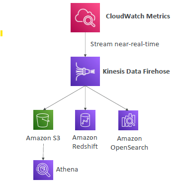
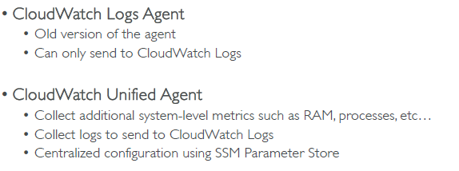
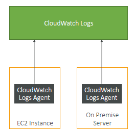
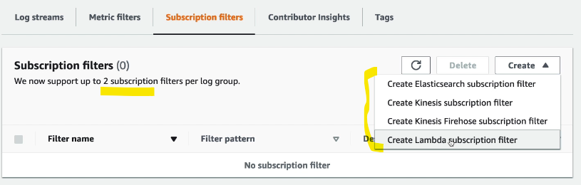
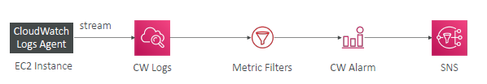

- https://www.udemy.com/course/aws-certified-developer-associate-dva-c01/learn/lecture/29322962#overview
- https://www.udemy.com/course/aws-certified-developer-associate-dva-c01/learn/lecture/37910042#overview
--- 
# Cloudwatch : `logs` :books:
- **expiration** policies
  - never expire
  - set 1 day to 10 years
- logs are **encrypted** by KMS

## 1 `log group`
- for each application create a log group
- 

---
## 2 `Log streams`
- instance within log group
- has **log event**

---
## 3 `log insight`
- 
- **query engine**
  - on historical logs-group on same/**cross**  aws account
- `log query >>> get result >>> export / visualize on CW::dashboard`
  - **purpose built query** language
  - find common query example on console itself.
  - fetch event, sort event, filter event, save and add to CW::dashboard.

---
## 4 `log source`
- `SDK`
  - java/py app running on
- **ECS/EKS**
  - container-agent : collect from containers
- **AWS Lambda**
  - lambda-agent : collect from function logs 
- **VPC Flow Logs**
- **Route53** 
- more:
  - API Gateway
  - Elastic Beanstalk : internal-app-agent
  - CloudTrail 
- **EC2 / on-prem server**
  - but install `agent`
    - **CloudWatch Unified Agent** : `new`
    - **CloudWatch log Agent** : `old`
    - 
    - 

---
## 5 `export logs`
### via `CreateExportTask`
- destination: **Amazon S3**
  - not real time
  - batch export
  - takes up to `12 hrs`

### via `log-group subscription-filter`
- **KDS** Kinesis Data Streams
- **KDF** Kinesis Data Firehose
- **Lambda**
- **OpenSearch**
- 

---
## 6 `log subscription-filter`
- can create `max=2`
- **subscribe** to **log group**
  - also, can also to listen/subscribe to multiple same/cross account's log group 
  - and perform **log aggregation**:
  - 
  - ignore above action, check below.
  
- **listener action/s**:
  - do some processing with Lambda
  - deliver (KDF)
  - stream (KFS)
  - 

--- 
## 7 `live trail`
- for debugging
- select log-group > log-instance (optional) > start trail
- 1 hr free every day
- close after done.

--- 
## 8 `metric filter`
- log-group > create **metric** on pattern-1
  - `max=3` **dimension**
- later on create alarm around this metric. [03_CW-Alarms.md](03_CW-Alarms.md)
- 

--- 
## ??
- **dashboard**
  - insight-rule-1 to ingest dashboard data
  - insight-rule-2
  - ...
- powered by `sagemaker`
- eg:
  - **lambda-insight**,
  - **CW-container-insight**
  - **app-insight**
  - **cw-contributor-insight**
    - build from `VPC logs`. etc
    - find heaviest n/w user, urlWithMostError, IPs,

---
## 99. hands on
```
- create lambda 
- run multiple time
- lambda "log-group-1" created :
    - log instance-1
    - log instance-2
    
// actions on  log-group-1 :
// 1. export to s3

// 2. create subscription-filter (max=2)
action: KDF > S3
    
// 4 . create log-stream-1 from log-group-1 > start live tail
...
```