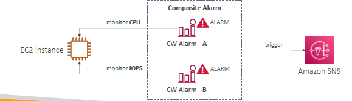

# Cloudwatch : `Alarm`  
- Trigger notifications for any **metric** value
  - set condtion : %, min,max, etc
  - set evaluation period.
- **states**
  - `ok` 
  - `in-alarm `
  - `insufficient-data`
- **action** : 
  - ec2 : reboot,recover , stop
  - **ASG**
  - **SNS alert** : most common :point_left:
  - ...
- **composite alarm** 
  - `alarm1` AND/OR `alarm2`
  - help to **reduce noise**
  - 
  
- alarm can be created on:
  - **any metric**
    - inbuild
    - custom: eg log metric-filter
  - **Ec2:status check**
    - instance status
    - attached EBS status
    - ...
  - ...


---
## D. demo
```
// 5 . create alarm
- launch ec2-i1 
- CW > create metric-1
  - add ec2-i1
  - type : cpu
  - every 5 min, 3 of 3
  - greater than 90%
  - state action:
    - ok > action:
    - in-alarrm > action : terminate ec2-i1
    - insufficient-data > action :
     >> manually update state from aws-cli
    
...

```


