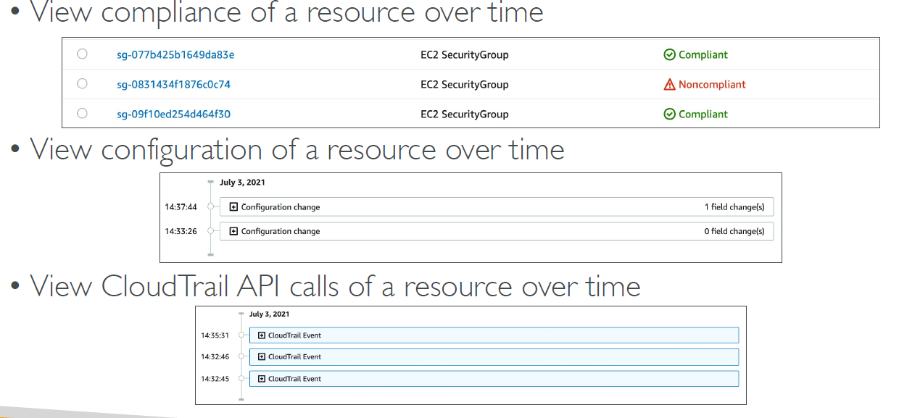
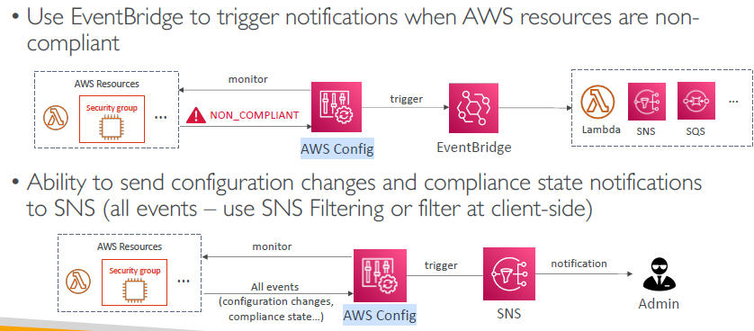

# AWS config (regional)
## 1. Intro
- record resource **auditing and Compliance** using **config-rules**.\

- on event of changes/modification on AWS resources =>  evaluate these rule 
  - take **remediation action**
  - send **notification**

- cannot not deny from evaluating. :point_left:
- for each aws-resource, on console can view :
  - **configured rules**  
  - **compliance status**
  - **CloudTrail api call**
  - **event table** : 
    - timeline of changes and other event.
- 

---
## 2. Config Rule
- `Json` configuration
### 2.1 AWS managed 
- already defined, 75+
- eg:
  - Check **unrestricted SSH** access to sg
  - Do we have **publicly accessed s3 buckets** 
  - Any changes made on **ALB** 

### 2.2 Custom rules 
- define using **Lambda function**
- eg:
  - evaluate :: EBS disk == type gp2
  - evaluate :: EC2 instance == t2.micro
    - all instance
    - by instance.id


## 3 Action on compliance failure
- **SSM Automation Document**
- **custom Automation Document**, eg:
  - 
  
### 3.1 notification
- use **Event-Bridge** Event
- use **SNS** -> filter -> subscriber
-   

---
## 4. Pricing: 
- no free tier, $0.003 per `configuration item` recorded per region,
- $0.001 per config rule `evaluation` per region

---
## 5. hands on
```
- AWS config, option:
    - Record for all resource **
    - Record for specfic resource
- create role-1
- choose delivery method: S3 bucket ** / cross acct bucket
- stream config change to SNS : T/F
- Rules (75 + ) : checkbox
    - approved amis by Id > enter parameter/s : ami id 
    - approved amis by tag
    - restricted-ssh > no parameter
        - play around > add/remove inbound rule for port 22/ssh
        - and check compliance status

```