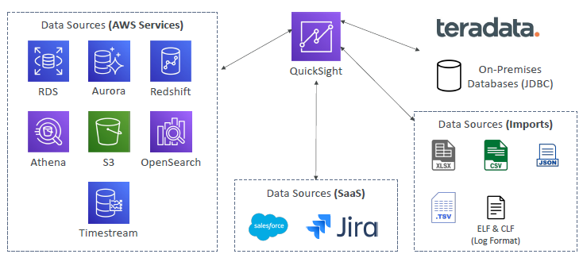

# QuickSight (Serverless)
- `ML-powered BI service` to create interactive `dashboards` (used for analysis)
- `im-memory computation` (AI/BI logic)
- > Source/s

- to access DashBoard, create `quickSight user` (diff from IAM-user)
- can `publish/share` dashboard.

