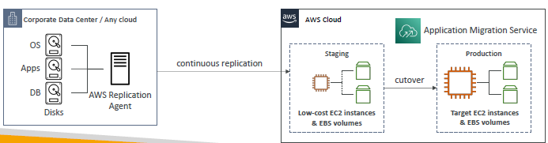

# D. on-prem tips

## 1. on-prem VM : import/export
- vm-1 is running on on-prem
- aws:ec2:`import` <-- vm-1
    - ec2-i1 running on cloud
- ec2-i1 --> aws:ec2:`export` --> on-prem(as vm-2)
    - vm-2 is running on on-prem

## 2. download AWS AMI to on-prem
- aws Amazon AMI --> download .iso file
- run AMI on on-prem , with hyper-v, virtual-box, etc.

---

# AWS service (overview)
## 1. Application discovery
- scan server and gather info from on-prem VM/server. gather data can be track : `Migration Hub`
- and then create `migration plan` out of it.
- Type of discovery(scan)
  - `agent-less` : gathers,
    - configuration
    - memory
    - disk usage
    - ...
  - `agent-based` : gathers addintional info like:
    - live network details, connections between systems
    - live system performance
    - live running processes
    - ...

## 2. MGN : Application migration service
- perform migration : 
  - `Lift and shift`.
  - convert `physical` server to `virtual` cloud server.
- supports wide range platform,os,db,volumes, etc
- hire dedicated engines to do this. `complex process`.
- minimal downtime.
- 

## 3. SMS : server migration service
- `incremental migration of live server data`

## 4. Migration Hub
- this help to `track` migration execution

## 5. DMS and SCT
- [DMS and SCT](./02_migration-2.md)

---
- fact/s
  - can also run `VMware software` on AWS