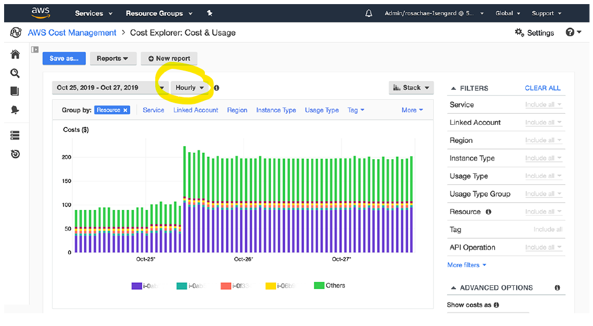
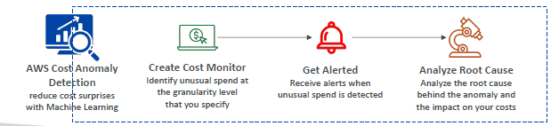

# Cost Explorer

- Create custom `reports` that analyze `cost and usage` data.
  - visual report(graph)
- `granularity`:  Monthly, hourly, resource level granularity
- recommends : `Savings Plan` 
- `Forecast usage` up to 12 months, based on previous usage

---
# AWS Cost Anomaly Detection
- Continuously monitor your cost and usage, using ML to `detect unusual spends`
- Sends anomaly detection report with `root-cause analysis`, with SNS.

