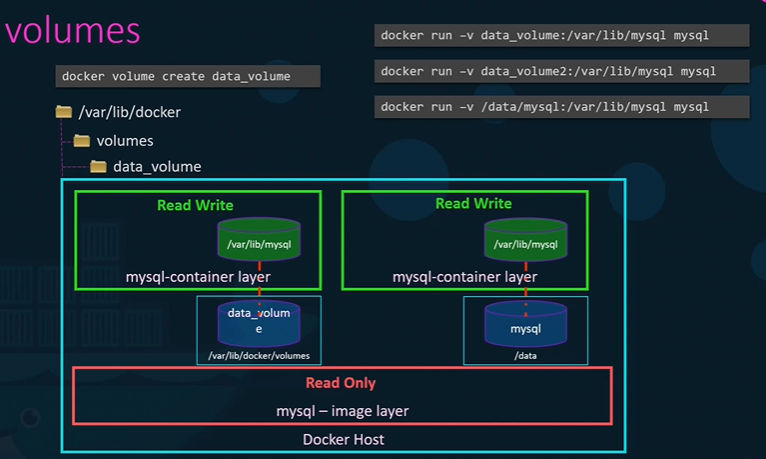
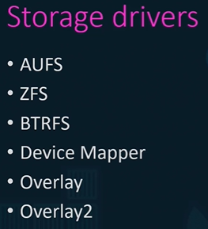

## A.Storage
- storage drivers : based on OS picks correct one.
- /var/lib/docker
  - **containers**
  - **images**
    - Stores all layers
  - **volumes**
    - docker volume `create` vol-1:location-on-`host` (loc1)
    - can see `/var/lib/docker/vol-1` then.

## B.Mount type
- -v is old
- use `--mount`
  - --mount type=volume, source=vol-1,           target=location-on-container
  - --mount type=bind,   source=external-drive , target=location-on-container
  
### volume mount
- docker run -v `vol-1`:location-on-`container` (loc2) c1
- perform R/W, retained after container destroyed.
- loc1 === loc2, or loc2 is mapped to loc1

### bind mount
- bind external drive to c1
- docker run -v `external-location`:location-on-`container` (loc2) c1

---
## Z.Screenshots

