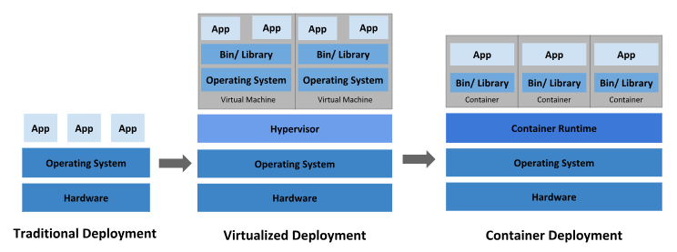
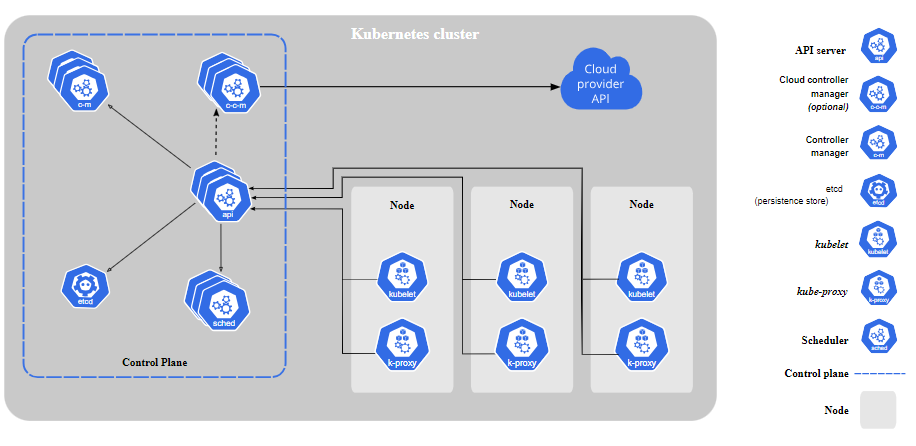
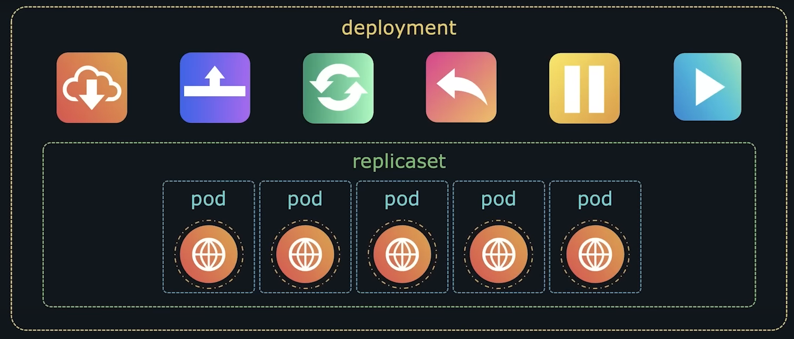

- reference:
  - https://chatgpt.com/c/da40b952-dbd9-46a9-ad58-92c828a89118
  - https://www.youtube.com/playlist?list=PLVz2XdJiJQxybsyOxK7WFtteH42ayn5i9
  - https://kubernetes.io/docs/concepts/overview/components/
---
# K8s Architecture
##  A. cluster
### `master Node` (1) / control panel
- Checks memory, health, CPU, etc for each WorkerNode.
    - `Kube-API Server` :
        - cluster-gateway
        - any request comes to cluster --> gateway --> WorkerNode --> ...
    - `Scheduler`
        - if WorkerNode-1 is 90%  and WorkerNode-1 is 30%, used.
        - then scheduler will assign new pods in WorkerNode-1
        - takes data from ETCD.
        - responsible for assigning workloads (pods) to nodes.
        - ensures workloads meet certain constraints and resource requirements.
    - `ETCD` :Persistence store.
    - `Controller manager`
        - runs `processes` in the background to regulate the state of the cluster.
        - Types/eg:
            - Node Controller
            - replication controller
            - Endpoints Controller
            - Service account and token Controller
    - `Cloud Controller Manager`
        - enabling Kubernetes to interact with underlying cloud provider APIs.

###  `worker Node` (Many)
- Container `Runtime`
  - to run containers (present inside Pods)
- `Kubelet`
  - agent running on each node.
  - masterNode::API-Server <-->  Kubelet-WorkerNode
  - Kubelet communicate with masterNode using API-server
- `kube-proxy`
  - Network config
  - Network traffic Rule (from/to nodes) ingress/outgress

### `Service Account`:  :point_left:
- represents processes running inside the Kubernetes cluster.
- Managed within Kubernetes
- created inside ns
- Service accounts use secrets that are automatically created and mounted to pods running under them.
- **permission** / `RBAC` : create role and role-binding for SA. (fine granular access)
- authentication not needed.
- scenario / use case:
  - **pod** using sa
    - sa token already generated and mounted on pod.
  - **jenkin** using sa - api call with sa token in Authorization header.
    - how to generate token
---
## B. outside cluster
### `User`:  :point_left:
- eg: An admin using `kubectl` to create a deployment.
- Represents a real human (`admins` / `developers`) or an external entity accessing the Kubernetes cluster.
-  Users are not managed by Kubernetes itself.
- they are managed outside of Kubernetes and autheticated through an `ext identity provider, OIDC`, `certificate management`, etc.).
    - minikube : certificate management
    - EKS : identity provider
- fine granular access - create role and role binding
    - admin : when cluster created one default admin is created with admin access.
    - developer user :
        - admin will create role and role binding
        - role binding - > role ref + subject(kind:user, name - use same user-name in kubeconfig file.) :point_left:

---
# summary
## 1. k8s componenets
- hierarchy :
    - `cluster` --> `node` --> `pod`,IP,workloads,posSpecYml/Json
    - `container` --> `app`

- `Pods`:
    - The smallest deployable units in Kubernetes that you create and manage.
    - pod/node talk to each other using `Service` (has DNS).

- `Replica Set`:
    - one pod goes down another comes up from replica set.
    - ensures certain no. of pod running at specific time at all the time.
    - uses selectors(label query)
    - scale in/out replica count : `horizontal scale`.
    - span with cluster.
    - Self-Healing:
        - If any of the pods managed by a ReplicaSet are deleted or fail, the ReplicaSet controller will create new ones to maintain the desired number of replicas.

- `Deployment Object`
    - higher-level concept that manages ReplicaSets + `updates on pods`/rollup/rollback.

- `scheduler`
    - decides which node, a pod is assigned to.

- `Kube-Controller-Manager`
    - Runs various controller processes in the background to regulate the state of the cluster.
    - Node Controller, Replication Controller, Endpoints Controller,etc

- `Services`:
    - Abstract a set of pods and provide a consistent way to access them, even if the individual pods' IP addresses change.

- `Nodes`:
    - The worker machines in the Kubernetes cluster, which can run multiple pods.
    - typically runs on a separate virtual machine (VM), but this is not a strict requirement.
    - in AWS, each node is  seperate  VM for isolation.
    - VMs can be easily resized, moved, or replicated,
    - contains: kubelet, kube-proxy, container-runtime.

- `Secret`:
    - Store DB config, password, etc outside SB app. then we dont need to build it again.
    - encrypted text, outside pod

- `Config map` : Plain text, outside pod.

- `ETCD` :
    - key-Value database/store,
    - 1MB max of a value.
    - store all its cluster data, such as cluster state, configurations, and metadata.

- `services`
    - An abstract way to expose an application running on a `set of Pods`, as a network service.
    - has DNS and static IP
    - 3 types:
        - `ClusterIP` : Exposes the service on a cluster-internal IP.
        - `NodePort` : Exposes the service on each Node's IP at a static port
        - `LoadBalancer` : Creates an external load balancer in the cloud provider (if supported) and assigns a fixed, external IP to the service.
    - Single Service for Multiple Pods (all having same image)
    - Separate Services for Different Pods (each having diff image)

- ingress controller (nginx, aws:alb, etc) and ingress-object
- admission controller, ServiceAcct, role, role binding.

- Add On:
    - `DNS Server`
    - `metric Server`
    - Web based `UI`
    - Cluster level `logging`
    - ingress controller ??
---

## 2. k8s features
- > can be deployed on cloud(ec2), on-prem(host), IaaS (EKS).
- Automate the Container deployment at `scale`
    - Horizontal scaling : add up/down more pods.
- `Automated Rollouts and Rollbacks`:
    - Automatically roll out changes and roll them back if something goes wrong.
- `Service Discovery and Load Balancing`:
    - Automatically assigns stable IP addresses and a single DNS name() for a set of containers),
    - to facilitate load balancing and service discovery.
- `Storage Orchestration`:
    - Automatically mounts the storage system of your choice:
        - whether from local storage
        - public cloud providers
        - or network storage systems.
- `Self-Healing`:
    - Restarts failed containers, replaces and reschedules them, and kills containers that don’t respond to user-defined health checks.
- `Secret and Configuration Management`:
    - Securely stores and manages sensitive information such as passwords, OAuth tokens, and SSH keys.
- `clustered systems` adv:
    -  increased performance, cost efficiency, reliability, workload distribution, and reduced latency.
- Implement policies to `secure access` to applications/MS/service running inside containers.
- Enable containers in a cluster to `communicate with each other` regardless of the host
- `scheduling`
- `Monitoring`
- `Batch Execution`.
- Pv4/IPv6 dual-stack

---
# screenshots for reference

