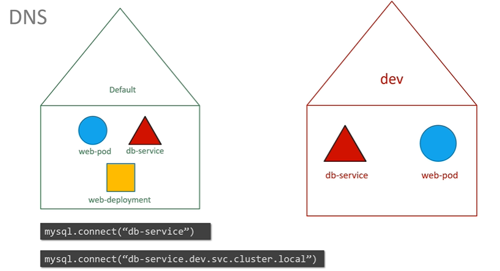
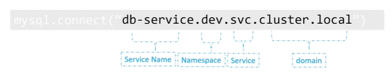
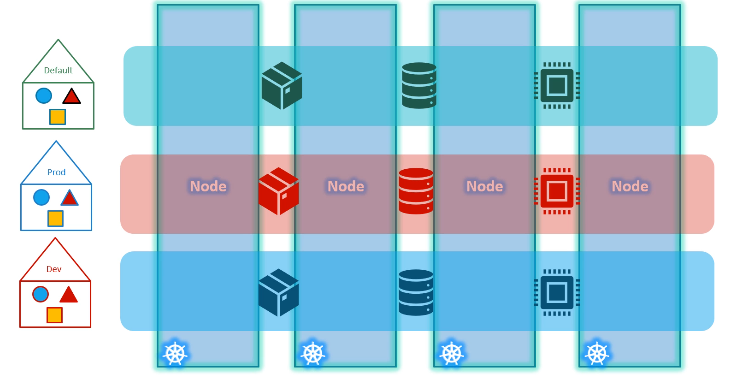

## namespace
- in command use : `--namespace=name-1` or just n=name-1
- or in definition yaml, just add `metadata > namespace:name-1 `
- used for `isolation`.
- have `polices`:
  - ResouceQuota : - to limit resource usage
  - ...
- ns already added by k8s:
  - kube-system
  - kube-public
  - default

- if having big-cluster which soo many pods, then better to create custom namespace 
  - namespace-1 : `dev` - pod-1, pod2, pod-3,etc
  - namespace-2 : `qa` - pod-1, pod2, pod-3
  - namespace-3 : `prod` - pod-1, pod2, pod-3

- Access services:
  - can access any service in **same** namespace by service-name(DN)
  - can access any service in **different** namespace using this DN format:
    - 
    - 

```
kubectl create ns dev-ns

apiVersion: v1
kind: Namespace
metadata:
  name: dev
  
kubectl create  -f  x.yaml
kubectl get pods --all-namespace

```
---
