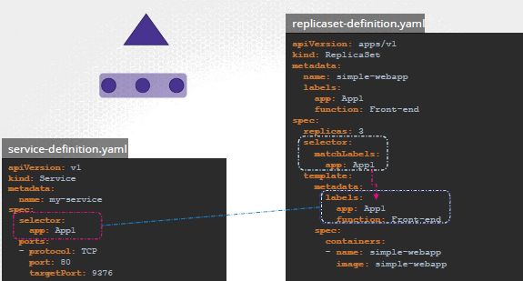

## Label, Selector
- used to group and select object
  - add label/s in pods
  - select pods in `deployment`, `service` and `rs` object with **selector**
    - 
- NodeSelector
- PodSelector
--- 
## annotation
- used to record detail for infomatory purpose.
- eg: metadata > annotations
  - buildVersion: v23.78

