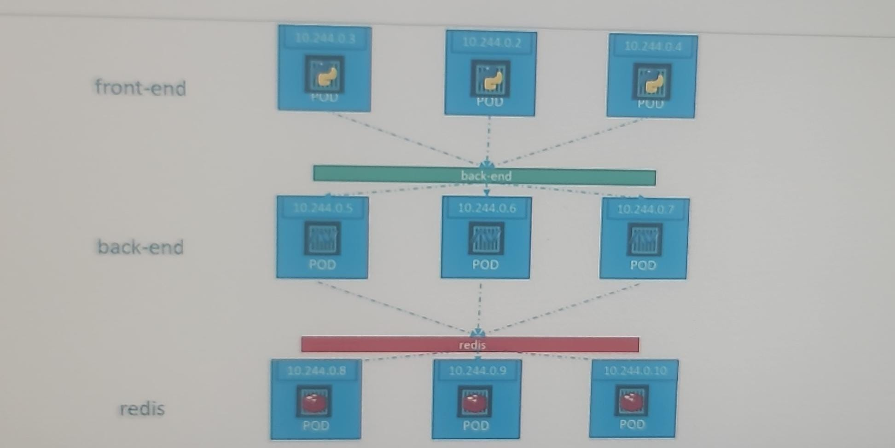
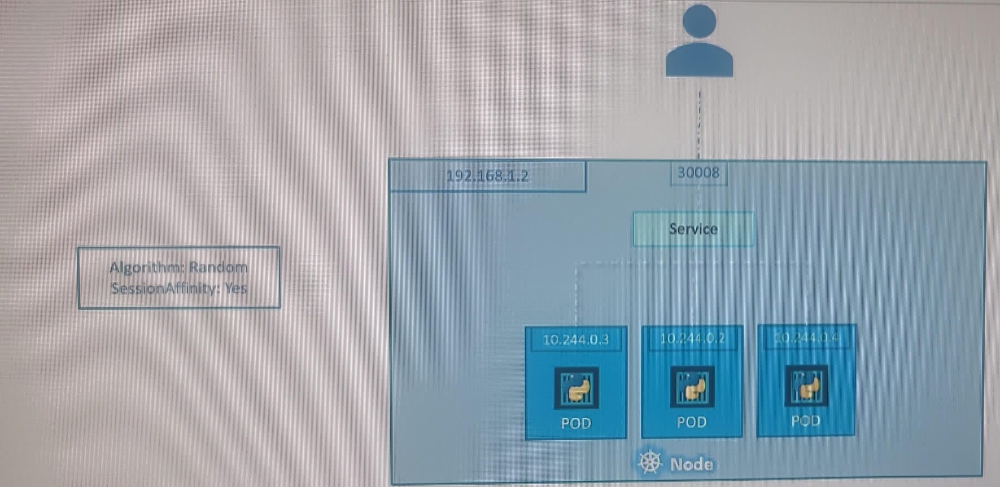

# pod/container communication

## A. within pod
- no service needed, just use localhost.
- use `localhost` for container/s comm inside a pod.

## B. Services
### ClusterIP: (pod 2 pod) : default
- Exposes the service internally within the cluster. 
- check for service IP (internal cluster IP, stable) 
  - manually grab it and use.
  - or use auto generated env var. `<service-Name>_SERVICE_HOST`
  - or use **coreDNS** - `<service-Name>.<namespace>`
- Accessible only within the cluster via a stable IP.
- also performs load balancing.
- enables loose coupling between pod/microservices
- 

---
### NodePort: (outside 2 pod)
- external-client --> internet --> k8s-cluster [  node-1[node-ip:node-port] > service-1[internal-ip:service-port] > pod/s[internal-ip:target-port]  ]
  - maps `port-on-Node` to `pod`::container::process(port)
  - listens traffic on node-port and forward traffic to pod.
  - Can be accessed externally using `<NodeIP>:<NodePort>`.
  - 
  - 
    - note: cloud-logo with 10.244.0.0, represents internal-network, here.
  - multipod service
    - 
    - 
    - span over multiple nodes
- Node IP can be changed. 
  - if 3 nodes, then 3 endpoints
---
### LoadBalancer: (outside 2 pod)
- Routes traffic to the backend pods through internet IP.
- if 3 nodes, then single endpoints
- use-case : cloud provider’s load balancer.
- **minikube service lb-service-name** --> it will give external url
  - in EKS, we don't need this additional step, can always see external url.

---
### headless service: (outside 2 pod directly)
- allows direct access to individual pod IPs without a load balancer or cluster IP. 

- Key Features:
  - `clusterIP: None`
  - `DNS-based Pod Discovery`:
    - Each pod gets its own DNS entry, useful for stateful applications where each pod has a unique identity 
    - (e.g., databases like Cassandra or StatefulSets).
  - `Direct Pod Access`:
    - Clients connect to pods directly, without load balancing.

- Use Cases:
  - `Stateful` applications (e.g., databases) that require direct access to specific pods.
  - Service discovery for applications that need `pod-level DNS` (e.g., my-headless-service-0.my-headless-service).
- This approach offers more control over **pod communication** compared to standard services.

---
# deploy frontend on K8s
- deploy frontend as pod/deploymnet object in k8s cluster
- have fe-service (expose on 8080), **loadbalance** Type
- host fe with **nginx**. 
- front end code --> while makeing api call, use `/my-be/***`
- in **nginx.conf** file
  - location `/my-be/` { proxy-pass https://fe-sevice.namespace1:8080 } 

---
# understand yaml
## properties
- `Enableservicelink`  : T/F - environment variables for services are automatically injected into the pod
- `sessionAffinity` : None
- `internalTrafficPolicy` Cluster or local(node)
- `ipFamily` :IPv4
- `ipFalimilyPolicy`: singleStack

## annotation

