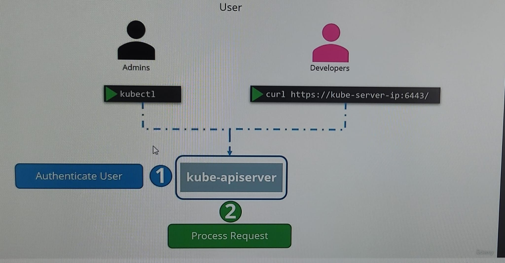

# Authentication
- 
- K8s cluster (`kube-apiserver`, running as system pod), will be accessed by :
  - `users (Admin / developer)` - we don't create them in k8s 
  - `SA` : we create these in k8s.
  - `end user` : out of scope. will be handled `inside application` deployed on k8s pod.

- NOTE : kube-apiserver is running as pod.
  - hence always update : /etc/kubernetes/manifests/kube-apiserver.yaml.
  - ps -ef | grep kube-apiserver 

---
## Authentication mechanism
### 1. Static password file  (basic Auth)
  - 
  - Modify the kube-apiserver startup options -
    - command section : add `--basic-auth-file=user-details.csv`
  - usage: curl -v -k https://master-node-ip:6443/api/v1/pods `-u "u1:p1"`
  - user-detail.csv --> pwd_1, username_1, userId, **groupId**
  - plain text file , hence **not** recommended. deprecated in Kubernetes version 1.19
  - 

### 2. Static token file
  - add `--token-auth-file=user-token-detail.csv` 
  - **token_1**, username_1, userId, groupId
  - usage: curl -v -k https://master-node-ip:6443/api/v1/pods `--header "Authorization: Bearer token_1"`
  - plain text file , hence **not** recommended. deprecated in Kubernetes version 1.19

### 3. Certificate
-  Note : generate certificates for different Kubernetes components and for a user and use them in the Kubernetes cluster is not in the scope of the official CKAD exam
- we don't create them in k8s
- first generate certificate for user. 
- All users certificates are stored at  --> `/etc/kubernetes/pki/users`
- check : [02-kubeconfig.md](./02-kubeConfig-file.md)
```
1. Generate a Private Key for the User:
- openssl genrsa -out newuser.key 2048

2. Create a Certificate Signing Request (CSR):
- openssl req -new -key newuser.key -out newuser.csr -subj "/CN=newuser/O=your-organization"

3. Sign the Certificate with Minikube’s CA
- openssl x509 -req -in newuser.csr -CA ~/.minikube/ca.crt -CAkey ~/.minikube/ca.key -CAcreateserial -out newuser.crt -days 365 -extensions v3_req

4. Add the New User to kubeconfig
- kubectl config set-credentials newuser --client-certificate=newuser.crt --client-key=newuser.key
- kubectl config set-context newuser-context --cluster=minikube --user=newuser
# minikube cluster a;lready exist.

5. Switch to the New User Context
kubectl config use-context newuser-context

```

### 4. External ID service - okta,LDAP.
- not in scope.

---
