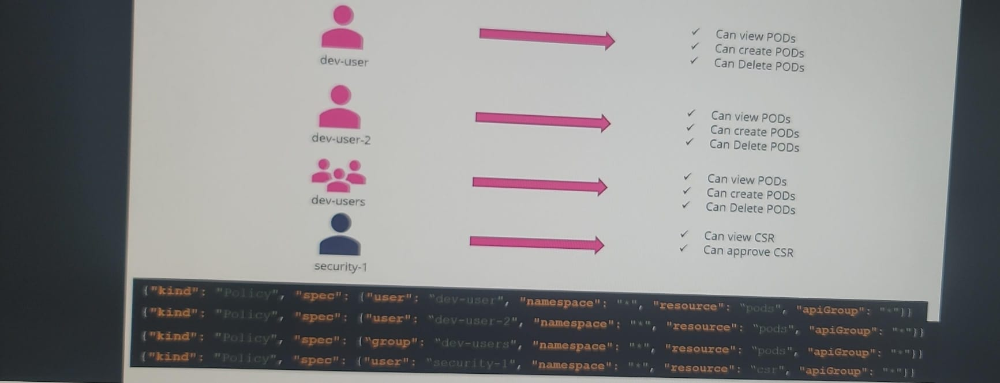
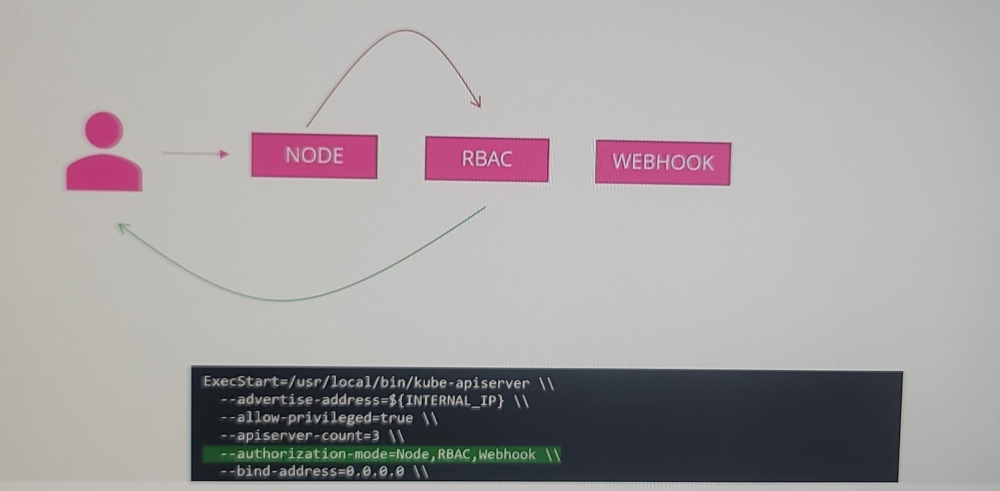

# Authorization
- check kube-apiserver setting:
  - kubectl get pods -n **kube-system** -o wide + then describe pod
  - cat **/etc/kubernetes/manifests/kube-apiserver.yaml**
  - ps -aux | grep kube-apiserver
  - 
## A. Common task for :
- `Admin` 
  - scaling : add node in cluster
  - network and security Policies
  - ResourceQuota and limits - storage
  - setting up RBAC rules
  - DR and backup.
- `Developer`
  - app deploymnet
  - configMap and secrets
  - horizontal scaling - add pod
  - manage services, expose pods.
  - monitor and debugging, logging.
- `sa` (eg: jenkins)
  - Accessing the Kubernetes API for tasks like resource discovery, scaling, or `configuration changes` within applications.
  - Running Jobs and CronJobs, workloads
  - `Automation` for admin and developer task.
---

## B. Authorization Mode
- kubectl get pods -n kube-system -o wide
### 1. Node
- built-in **special authorizer** for kubelets.
- allows Kubernetes nodes (`kubelets`) to access only resources needed to manage pods on that node.
  - READ : service, nodes, pods, 
  - Write : pod status, node status, event
- Note: group system-node --> kubelets are part of this.
- request coming from this group is authorized by special authorizer  ( called Node-Authorizer )

### 2. ABAC (attribute based)
- built-in.
- permissions are defined in a **policy JSON file** with specific attributes like user, namespace, verb, resource, etc.
- ABAC is `less flexible`, thus difficult to manage.
- 

### 3. RBAC (Role based)
- built-in
- Most efficient. like in aws.
- create role-1 (permission-1, 2, ...)
- then associate users (u1, u2, group1, sa1 ...) with role-1
- Create below 2 definitions:
  - **Role** --> `rules`: list of [ apigroup, resources, verb, resourceName ]
    - role for **namespace scoped resource**
    - eg: pod, service, sa
  - **RoleBinding** --> `subject/s` (user,sa) and `roleRef` :point_left:
  - 
  - 

### 4. webhook 
- `open policy agent`, helps to connect to 3rd party authorization server.
- forwards authorization requests to an external service over a webhook API.
- use-case: **custom** authorization logic outside of Kubernetes

### 5. / 6.  Always allowed / denied

---
- configure above modes in kubeapi config. 
  - authorization-mode=
  - can setup multiple mode. it moves to from one to another until authorized.
  - 

## C. Check Access
- kubectl auth can-i [create|delete]    [deploymnets|node|pods] --as user1 --namespace ns1