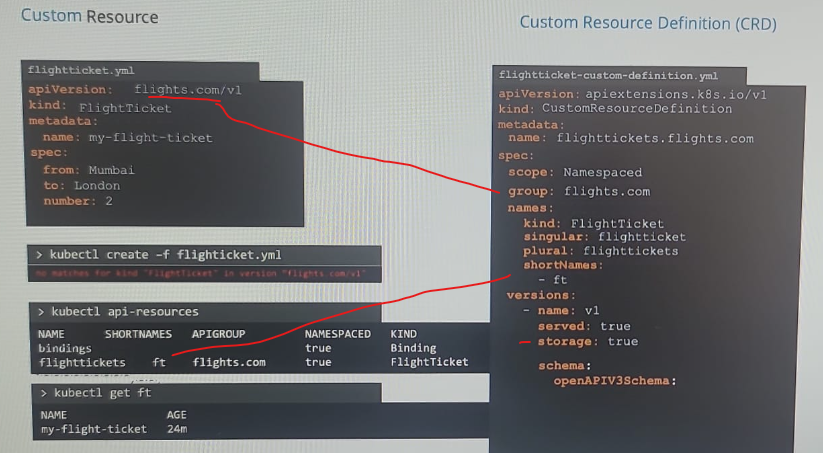

## Custom Resource.
### STEP-1 : custom `resource definition` (CRD)
- 
- 
- `k create -f flightticket.yaml`
- `k get flighttickets`. it will go into `pending` state.
- `k create -f flightticket.yaml`
- now its in etcd.
- note: scope - `Namespaced` or `clustered`.

### STEP-2 : Custom `controller` (CC)
- next, look into etcd and take action.
- clone : https://github.com/kubernetes/sample-controller.git (language : go)
- run it as pod inside cluster.
- 

---

## operator framework (INTRO)
- CRD and CC can be deployed together as single entity using this.
- perform addition things too. check operatorhub.io
- install it and us it.
- Note: out of scope in CKAD exam.