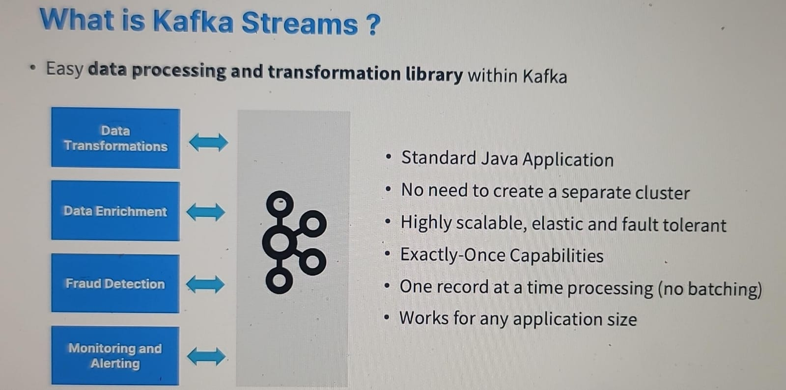
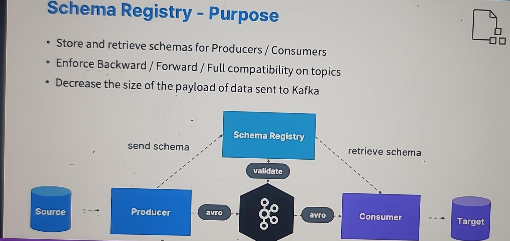
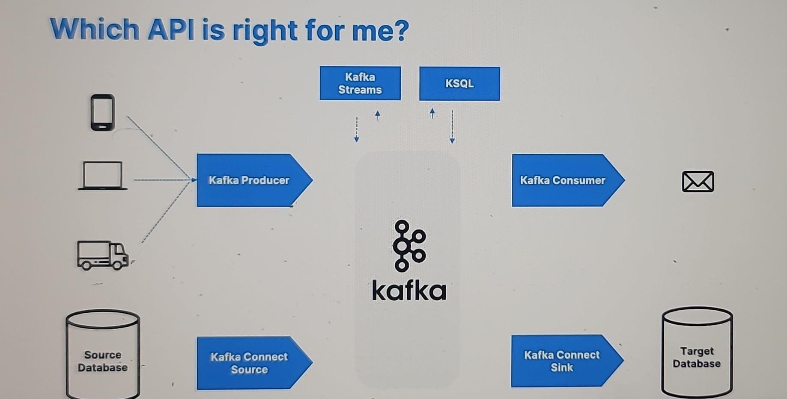

# reference:
- https://github.com/conduktor/kafka-connect-wikimedia
---
# Kafka Extended API (`intro`)
## A. Kafka connect

- **use case**:
```
  - external-source --> kafka topic
  - kafka topic     --> external-sink
```
- all abt re-using connector code.
- use in ETL  :point_left:
- don't write your owen producer/consumer code. find connector and **re-use**.
  - look at : https://www.confluent.io/hub

- **benefit**:
  - fault tolerated
  - idempotent producer / consumers
  - ordering 
  - other common issues pre-fixed :)
- project:
  - https://github.com/conduktor/kafka-connect-wikimedia
  - https://www.udemy.com/course/apache-kafka/learn/lecture/11567132#overview
  - https://www.confluent.io/hub/confluentinc/kafka-connect-elasticsearch
---
## B. kafka stream
- kafka:topic-1 -->  kafka:topic-1
- 

---
## C. schema registry
- 

---
# Summary
