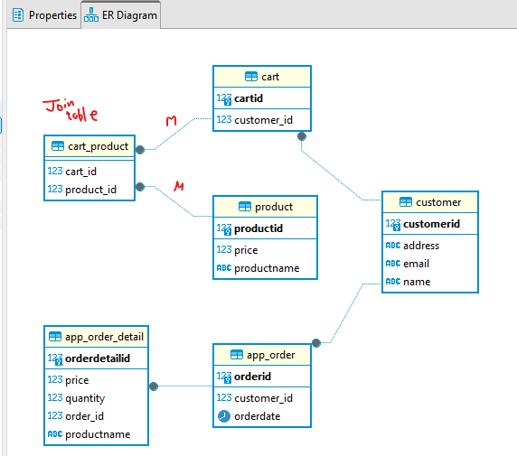

## project: 
- code: [database](..%2F..%2F..%2Fsrc%2Fmain%2Fjava%2Fcom%2Flekhraj%2Fjava%2Fspring%2Fdatabase)
- db: postgres - running locally on pod.
- 

---
- All: https://chatgpt.com/c/674bee20-d9e4-800d-a31e-8f60a5f511ab
  - core concept: https://chatgpt.com/c/674d6fa4-7e4c-800d-9d48-54f566791d8d

    
---
## B. **Constraints**
- **NOT NULL**
- **UNIQUE**
- **PRIMARY KEY** : `unique + not_null` 
- **FOREIGN KEY** : `referential integrity`
  - relationship between columns in two tables.
  - The foreign key column in one table references the primary key in another table
- **CHECK** 
- **DEFAULT**
- **DOMAIN** : custom constraint. define and reuse.
  ```
  CREATE DOMAIN positive_integer AS INT
    CHECK (VALUE > 0);
  ```
- Note: can combine multiple. point_left:
```
CREATE TABLE orders (
    order_id SERIAL PRIMARY KEY,
    emp_id INT REFERENCES employees(emp_id)   [ ON DELETE CASCADE  |  ON UPDATE CASCADE ]
    name TEXT UNIQUE NOT NULL DEFAULT 'active',
    qty INT CHECK (qty > 0) positive_integer,
);

or 

CREATE TABLE orders (
    order_id SERIAL ,
    emp_id INT,
    name TEXT
    
    PRIMARY KEY (order_id)
    PRIMARY KEY (order_id, another-column) --composite PK
    UNIQUE (TEXT)
    FOREIGN KEY (emp_id) REFERENCES employees(emp_id)    [ ON DELETE CASCADE  |  ON UPDATE CASCADE ]
);


ALTER TABLE employees 
  ADD CONSTRAINT emp_name_unique UNIQUE (name);

ALTER TABLE employees 
  DROP CONSTRAINT emp_name_unique;
```

---
## C **sequence**
- pending

