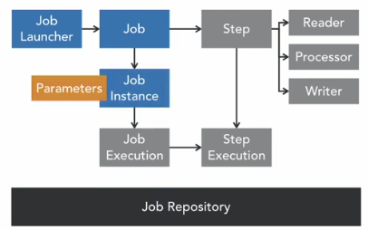
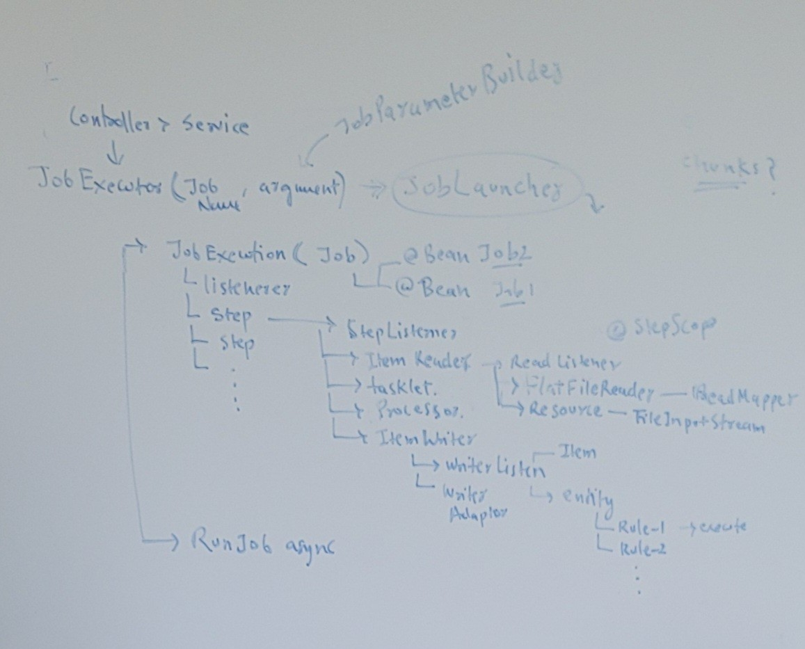

- https://spring.io/projects/spring-batch
- https://www.linkedin.com/learning/spring-spring-batch
- project : [springbatch](../../src/main/java/com/lekhraj/java/spring/etl/springbatch)

---
## A. Architecture

###  key components
- **Job**     : Represents the batch process.
- **Step**    : A stage in the job (e.g., reading, processing, writing).
- **ItemReader** : Reads data from a source.
- **ItemProcessor** : Processes data (optional).
- **ItemWriter** : Writes processed data to a destination.
- **JobRepository** - 
  - explicitly handles persistence of batch metadata, ensuring better control and compatibility with the latest versions.
  - set schema:
    - spring.datasource.url=jdbc:postgresql://localhost:5432/your_db?currentSchema=**schema_name**
    - String sql = "SELECT * FROM **schema_name**.table_name";
    - jdbcTemplate.execute("SET search_path TO **schema_name**");
    - dataSource.addDataSourceProperty("currentSchema", "schema_name");
---  
## B SpringBoot / Spring-batch (5.x.x)
- `Spring Framework 6.x` | `Spring Boot 3.x` | `Java 17`
- powerful framework for batch processing in Java.

### 1 key features
-  it provides the necessary components to build robust, scalable, and customizable ETL pipelines.
- ETL processes require `highly customized transformations` and logic that traditional tools may not handle efficiently.
- Spring Batch is open-source, making it a `cost-effective` alternative to commercial ETL tools
-  works seamlessly with CI/CD pipelines and modern deployment methods like Docker and Kubernetes. :point_left:
- downside:
  - no visual interface.
  - ETL tools are faster to set up for simple tasks, while Spring Batch requires coding and configuration.
- designed to handle **large volumes of data** by:
  - dividing it into smaller `chunks`,
  - providing capabilities like transaction management,
  - Chunk-Based Processing + parallel chunk processing
```
@EnableBatchProcessing(
        dataSourceRef = "dataSource_for_postgres2",
        transactionManagerRef = "transactionManager_for_postgres2"
)

<dependency>
	<groupId>org.springframework.boot</groupId>
	<artifactId>spring-boot-starter-batch</artifactId>
</dependency>

@EnableAsync 
tells Spring to look for methods annotated with @Async and execute them asynchronously.
		
```
### 2 add dashboard
```
<dependency>
    <groupId>org.springframework.batch</groupId>
    <artifactId>spring-batch-admin-manager</artifactId>
    <version>2.0.0.M3</version>
</dependency>
```
---
### 3 add Observability for job
- Out-of-the-box support for `distributed tracing` and `metrics` using **Micrometer**.
- Compatible with tools like **OpenTelemetry** for tracing batch jobs.
- Configure tracing and metrics to monitor your batch jobs in a `distributed environment`
```
  <dependency>
  <groupId>io.micrometer</groupId>
  <artifactId>micrometer-tracing-bridge-otel</artifactId>
   </dependency>
  
   <dependency>
  <groupId>io.opentelemetry</groupId>
  <artifactId>opentelemetry-exporter-otlp</artifactId>
   </dependency>
```
### 4 Monitor
- https://github.com/spring-projects/spring-batch/blob/main/spring-batch-core/src/main/resources/org/springframework/batch/core/schema-postgresql.sql
- [BatchDDLRunner.java](../../src/main/java/com/lekhraj/java/spring/etl/springbatch/BatchDDLRunner.java)
- table (6)
  - batch_job_execution: Stores metadata about job executions, such as job parameters, status, and the time it was started and finished.
  - batch_job_execution_context: Stores execution context data (such as intermediate results or application-specific data) for each job execution. It is associated with batch_job_execution via a foreign key.
  - batch_job_execution_params: Stores the parameters passed to the job during its execution, usually stored as key-value pairs.
  - batch_job_instance: Stores metadata about the job instance. This tracks the distinct logical execution of a job. For example, if you run the same job multiple times with different parameters, each run would have a separate job instance.
  - batch_step_execution: Stores metadata about individual step executions within a job, such as status, start time, and end time for each step.
  - batch_step_execution_context: Similar to batch_job_execution_context, but this table stores the execution context data for each step of the job.

---
