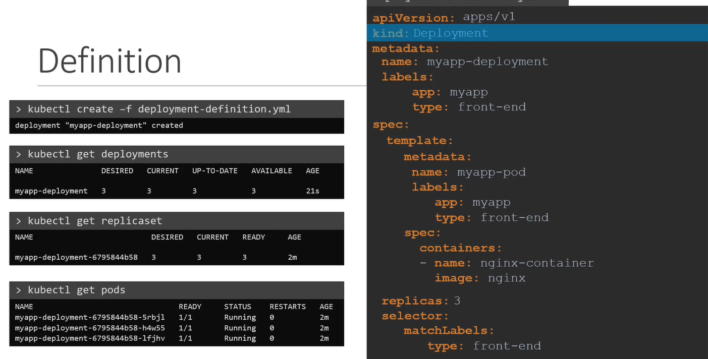

## Deployment Object
- deployment (has all revision history)
  - replicationSet-1 (revison=1)
  - replicationSet-2 (revison=2)
  - ...
  - replicationSet-n (current)
- concept:
  - deploy pod/s
  - upgrade (upgrade all pods together)
  - rollout (upgrade pods `one after another`)
  - rollback
  - pause and resume
- yaml is same as rs
  - just update kind to deployment object.

- some command 
``` 
  - kubectl get deployments
   
  - kubectl create deployment --image=nginx nginx
  
  - kubectl create deployment --image=nginx nginx --dry-run -o yaml > def.yaml
  
  - kubectl scale deployment nginx --replicas=4
  
  - kubectl edit deployment d1  :)
    - With Deployments, you can easily edit "any" field/property of the POD template. 
    - unlike pod edit, few feilds can edit.
    - Since the pod template is a child of the deployment specification, 
    - the deployment will automatically delete and create a new pod with the new changes. 
    
```
---




--- 
## understand yaml

### properties
- **progressDeadlineSeconds**: 600 , **terminationGraceperiodSeconds**: 30
- **revisionHistoryLimit** : 10
- **strategy**
  - rollingUpdate
    - maxSurge:
    - maxUnavailable: 
  - type: recreate / rollingUpdate  *
- **dnsPolicy**: clusterFirst  
  - how DNS resolution is handled within the pod.
  - `clusterFirst` : 
    - Uses the `cluster’s DNS` service first for resolution. 
    - If the DNS query fails, it will fall back to the `host’s DNS`.
  - Default : `host’s DNS`
  - `None`

## annotations (ignore)
- `kubectl.kubernetes.io/restartedAt`: Used to trigger a manual restart of the pods within the Deployment. Setting this annotation to a new timestamp forces a rollout restart, commonly used for manual updates without changing the Deployment spec.
- `prometheus.io/scrape `
- `prometheus.io/port`: Often used in Deployments where Prometheus monitoring is set up. Setting prometheus.io/scrape: "true" tells Prometheus to scrape metrics, and prometheus.io/port specifies the port to scrape from.
- `app.kubernetes.io/name`,
- `app.kubernetes.io/version`,
- `app.kubernetes.io/component:` These labels are often applied as annotations for organizational purposes, helping to identify the application's name, version, and component type, improving tracking and monitoring.
- `sidecar.istio.io/inject`: Common in clusters with Istio service mesh. Setting sidecar.istio.io/inject: "false" on a Deployment prevents Istio from injecting its sidecar container, useful for excluding specific pods from the mesh.
- `checksum/config `
- `checksum/secret`: Used to force a Deployment rollout when ConfigMaps or Secrets change. By updating the checksum when there are updates, Kubernetes detects a change and re-deploys the pods.
