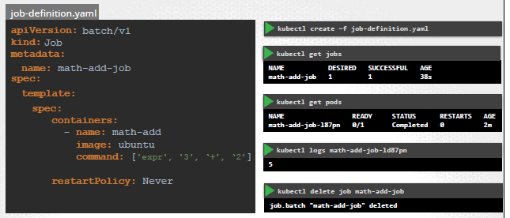

## Job
- 
- `ReplicaSet` : make sure set of pod running all the time
- `Job` : make sure set pod of completed desired task and exited then.

```
apiVersion: batch/v1
kind: Job
metadata: 
    name:
spec:  # <spec of job>
    completions: 3   <<<< sequentially starts pod one after another
    parallelism: 3   <<<< if present, then parallel pods runs
    template: #pod
        spec:
            restartPolicy: Never  <<<< prevent restart
            conatiners:
                - 
                - 
```

## CronJob
- jobs runs instantly
- cronJob can be `scheduled`
```
apiVersion: batch/v1beta
kind: CronJob
metadata:
    name:
spec: # <spec of Cronjob>
    schedule: "*/1 * * * * *"
    jobTemplate:
        <spec of job>
```
---
## Screenshot:
  - 
  - 
  - 


