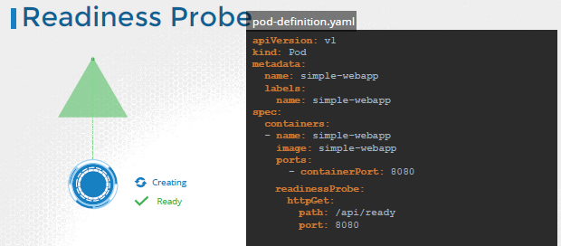
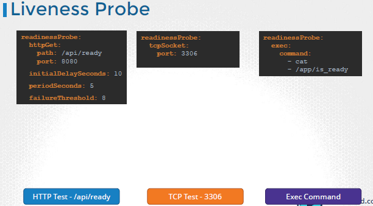

- pod **status**
  - `pending` - when first created
  - `creatingContainer` - once scheduled
  - `Running` - once all container started

- pod **condition**  : array of `true/false`. describe pod and check these.
  - podScheduled
  - initialized
  - containersReady
  - `Ready` : all container ready. pod ready

--- 
## Readiness
- eg: **jenkin** pod ready but actual process take additional 15 section to come up.
    - which is confusing. because service can start sending traffic to pod once READY.
    - solution: readiness probe : helps to get actual application/process status
  
- 
- 

## liveness
- fact:
    - docker run nginx > `exited`,  since no process running
    - k run nginx --image=nginx > `exited > re-run > exited > re-run > ....`
  
- container is up in pod, but application is NOT healthy (some code bug)
- liveness probe can be deifined to periodically test if app is healthy.
- developer define defination of healthy.
- 
- 
